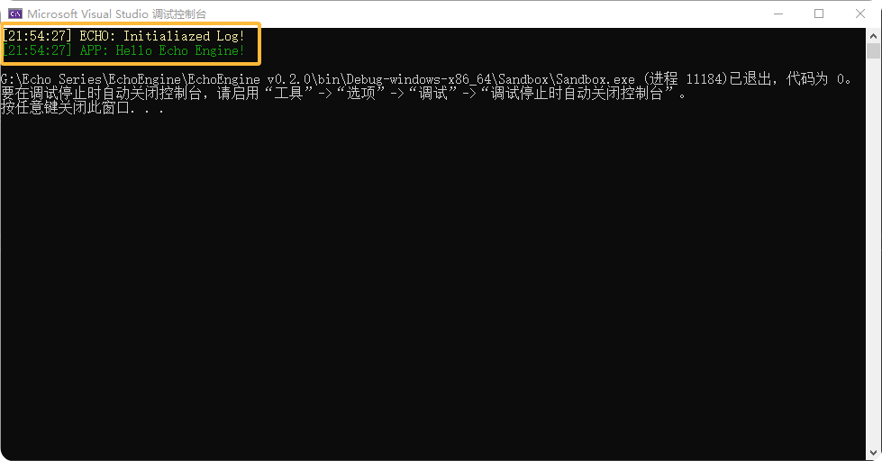

本篇将记录EchoEngine的Log模块的开发要点，文中项目文件结构可参考下方项目仓库。

**项目仓库：**

::github{repo="Jerryym/EchoEngine"}

---

## 日志模块

### 为什么要设计日志模块

日志模块是软件系统中不可或缺的部分，它通过记录程序的运行状态、错误信息和关键事件，为开发和运维提供了重要的数据支持。日志模块的主要功能包括：

1. **问题诊断**：通过日志快速定位系统中的问题，减少故障排查时间。
2. **调试与测试**：在开发过程中记录调试信息，帮助开发者分析程序逻辑和性能。
3. **运行监控**：实时或离线监控系统状态，确保系统运行正常。
4. **安全审计**：记录关键操作和事件，为安全问题提供审计依据。
5. **数据分析**：日志信息可用于业务分析、性能优化或行为统计。

### 常用的C++日志库

* [spdlog](https://github.com/gabime/spdlog)
  * 基于`fmt`的高性能日志库
  * 支持多线程和异步日志
  * 提供日志级别、文件滚动、时间戳等功能
  * 示例代码:

    ```c++
    #include <spdlog/spdlog.h>
    int main() 
    {
        spdlog::info("Application started!");
        spdlog::error("This is an error message!");
        return 0;
    }
    ```

* [glog](https://github.com/google/glog)
  * 由 Google 提供的日志库
  * 提供分级别日志（INFO, WARNING, ERROR, FATAL）
  * 支持日志文件输出和条件检查（`CHECK` 宏）
  * 示例代码:

    ```c++
    #include <glog/logging.h>
    int main(int argc, char* argv[]) 
    {
        google::InitGoogleLogging(argv[0]);
        LOG(INFO) << "Starting the application!";
        LOG(ERROR) << "An error occurred.";
        return 0;
    }
    ```

* [Boost.Log](https://github.com/boostorg/log)
  * Boost 库中的日志组件
  * 支持多线程和多种日志格式
  * 可高度定制化日志行为
  * 示例代码:

    ```c++
    #include <boost/log/trivial.hpp>
    int main() 
    {
        BOOST_LOG_TRIVIAL(info) << "Boost.Log initialized!";
        return 0;
    }
    ```

### 设计原则

* **性能优先**：在高并发或实时系统中，日志模块必须具备高效的写入和存储性能，可选择异步日志或内存缓冲机制。
* **可扩展性**：支持多种输出目标（控制台、文件、远程服务器）和格式化方式，满足不同场景需求。
* **日志分级**：设计不同的日志级别（如**DEBUG、INFO、WARN、ERROR**）以便控制输出的粒度。
* **线程安全**：在多线程环境中确保日志模块的安全性，例如通过线程本地存储或锁机制。
* **配置灵活**：允许通过配置文件或运行时接口调整日志级别、格式和存储路径等。

---

## EchoEngine中的日志模块

在EchoEngine中，我将spdlog库作为第三方构件来支撑引擎中的日志模块。

* 使用命令`git submodule add https://github.com/Jerryym/spdlog.git Echo/vendor/spdlog`将spdlog作为子模块添加到Echo Engine项目中，并通过命令`git submodule update --init --recursive`保证子模块被正确初始化和更新。
* 定义了`Log`类用于设计日志模块。在类中，我定义了两个日志对象分别用于管理引擎端日志/核心层日志`s_CoreLogger`和客户端日志`s_ClientLogger`，并定义了相关宏用于简化在使用日志时的代码。

```c++
#pragma once

#include "Core.h"
#include "spdlog/spdlog.h"
#include "spdlog/sinks/stdout_color_sinks.h"
#include "spdlog/fmt/ostr.h"

namespace Echo {

    /// @brief 日志
    class Log
    {
    public:
        /// @brief 初始化日志系统
        static void Init();

        /// @brief 获取引擎端日志
        /// @return 
        inline static std::shared_ptr<spdlog::logger>& GetCoreLogger() { return s_CoreLogger; }

        /// @brief 获取客户端日志
        /// @return 
        inline static std::shared_ptr<spdlog::logger>& GetClientLogger() { return s_ClientLogger; }

    private:
        static std::shared_ptr<spdlog::logger> s_CoreLogger;  // 引擎端日志对象(智能指针)
        static std::shared_ptr<spdlog::logger> s_ClientLogger;  // 客户端日志对象(智能指针)
    };

}

// Core log macros
#define ECHO_CORE_TRACE(...)        ::Echo::Log::GetCoreLogger()->trace(__VA_ARGS__)
#define ECHO_CORE_INFO(...)         ::Echo::Log::GetCoreLogger()->info(__VA_ARGS__)
#define ECHO_CORE_WARN(...)         ::Echo::Log::GetCoreLogger()->warn(__VA_ARGS__)
#define ECHO_CORE_ERROR(...)        ::Echo::Log::GetCoreLogger()->error(__VA_ARGS__)
#define ECHO_CORE_CRITICAL(...)     ::Echo::Log::GetCoreLogger()->critical(__VA_ARGS__)

// Client log macros
#define ECHO_CLIENT_TRACE(...)      ::Echo::Log::GetClientLogger()->trace(__VA_ARGS__)
#define ECHO_CLIENT_INFO(...)       ::Echo::Log::GetClientLogger()->info(__VA_ARGS__)
#define ECHO_CLIENT_WARN(...)       ::Echo::Log::GetClientLogger()->warn(__VA_ARGS__)
#define ECHO_CLIENT_ERROR(...)      ::Echo::Log::GetClientLogger()->error(__VA_ARGS__)
#define ECHO_CLIENT_CRITICAL(...)   ::Echo::Log::GetClientLogger()->critical(__VA_ARGS__)
```

```c++
#include "echopch.h"
#include "Log.h"

namespace Echo {

    std::shared_ptr<spdlog::logger> Log::s_CoreLogger;
    std::shared_ptr<spdlog::logger> Log::s_ClientLogger;

    void Log::Init()
    {
        // 更改日志模式
        spdlog::set_pattern("%^[%T] %n: %v%$");

        // 初始化引擎端日志对象的颜色和等级
        s_CoreLogger = spdlog::stdout_color_mt("ECHO");
        s_CoreLogger->set_level(spdlog::level::trace);

        // 初始化客户端日志对象的颜色和等级
        s_ClientLogger = spdlog::stdout_color_mt("APP");
        s_ClientLogger->set_level(spdlog::level::trace);
    }

}

```

* 为了实现引擎在运行时能够优先初始化日志系统，我修改了`EntryPoint.h`文件中的代码，在`main`函数一开始添加了初始化日志系统的代码。

    ``` cpp
    #pragma once
    extern Echo::Application* Echo::CreateApplication();

    int main(int argc, char** argv)
    {
        //初始化日志系统
        Echo::Log::Init();
        ECHO_CORE_WARN("Initialiazed Log!");
        ECHO_CLIENT_INFO("Hello Echo Engine!");

        //创建应用系统
        auto app = Echo::CreateApplication();
        app->Run();
        delete app;

        return 0;
    }
    ```

* **运行测试**：生成`Echo`项目并按下`F5`运行程序，可以看到在控制台中打印出了相关级别的日志信息，大功告成o(*￣▽￣*)ブ


---

## Reference

[1] [spdlog](https://github.com/gabime/spdlog)

[2] [spdlog wiki](https://github.com/gabime/spdlog/wiki)
