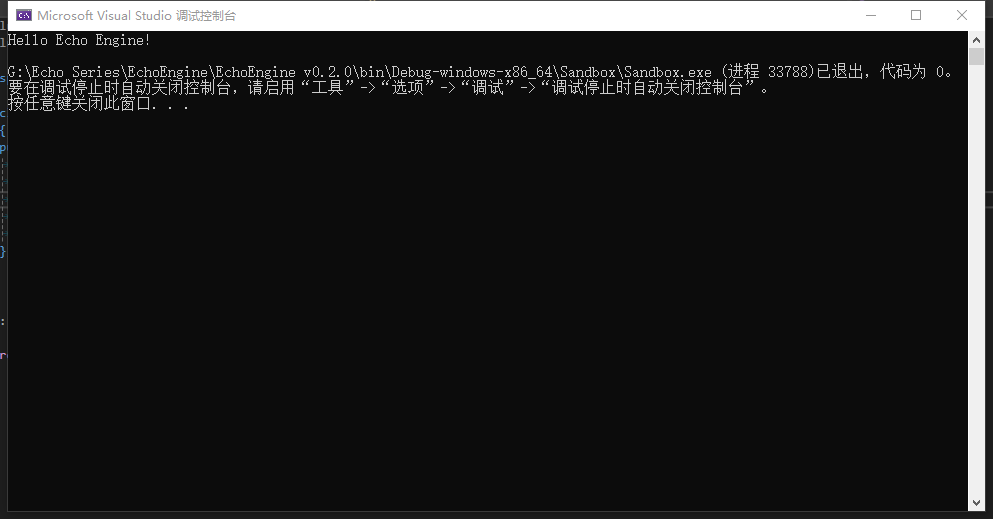

前几篇介绍了EchoEngine的设计思路，从本篇开始，将记录实际开发过程中的开发要点。本篇将记录EchoEngine的Application和EntryPoint中的开发要点，文中项目文件结构可参考下方项目仓库中的文件结构。

**项目仓库：**

::github{repo="Jerryym/EchoEngine"}

---

## 项目准备

### 项目创建

Echo Engine项目创建步骤如下：

1. 打开Visual Studio 2022创建一个新解决方案名为 `EchoEngine`。
2. 创建第一个项目名为 `Echo`，并设置为静态库 `.lib`类型，此项目将编写类似VertexBuffer、IndexBuffer、Shader等渲染引擎相关的功能代码。
3. 创建第二个项目名为 `SandBox`，并设置为启动项，此项目将作为Echo Engine的客户端。

### 第三方库准备

在本项目中，我将用到多个第三方库。目前在项目准备阶段，我将优先集成两个第三方库：[GLFW](https://github.com/glfw/glfw)和[GLAD](https://glad.dav1d.de/)，以增强我们的图形处理和窗口管理能力。

* **GLFW**：是继GLUT之后，当前最新的用来创建和管理OpenGL上下文，以及操作窗口的第三方库。

  * 在GitHub上找到GLFW的官方仓库并Fork到自己账号下。
  * 使用git命令将GLFW作为子模块添加到Echo Engine您的项中

    ```bash
    git submodule add https://github.com/glfw/glfw.git Echo/vendor/GLFW
    ```

  * 运行命令以确保所有子模块被正确初始化和更新

    ```bash
    git submodule update --init --recursive
    ```

* **GLAD**：是继GLEW之后，当前最新的用来访问OpenGL规范接口的第三方库，目前支持的最新OpenGL版本是 `4.6`。

  * 访问GLAD的官方网站，下载最新版本的源代码。
  * 将下载的压缩包解压到Echo项目的 `vendor`目录下。

---

## Application

在探讨应用程序资源管理时，我们不难发现，高效地管理资源并确保在程序结束时释放资源，是确保应用程序性能和稳定性的关键。在Qt框架中，`QApplication`类扮演着核心角色，它不仅负责应用程序的生命周期管理，还提供了一系列与应用程序相关的功能。因此，我借鉴了 `QApplication`的设计理念来设计 `Application`类，以实现EchoEngine能够确保在应用程序的整个生命周期中，资源得到有效管理。

* **单例模式的应用**

在应用程序设计中，我希望确保全局只有一个应用程序实例在运行。这正是单例模式大显身手的地方。通过实现单例模式，我们可以控制应用程序的实例化过程，确保在整个应用程序的生命周期内，只有一个 `Application`类的实例存在。

* **运行状态管理**

应用程序的运行状态是其核心属性之一。通过在 `Application`类中引入一个布尔类型的变量，可以轻松地跟踪和控制应用程序的启动和关闭状态，其值在应用程序启动时设置为 `true`，在应用程序关闭时设置为 `false`。

* Application.h

  ```cpp
  /// @brief 应用程序类：用于管理应用程序运行状态和运行中的资源
  class Application
  {
  public:
      Application();
      virtual ~Application() {}

  public:
      /// @brief 启动应用程序
      void Run();

      /// @brief 获取当前应用程序
      /// @return 当前运行的应用程序指针
      inline static Application& GetApplication() { return *s_Instance; }

  private:
      /// @brief 应用程序单例（程序运行时，当且只能一个应用程序存在）
      static Application* s_Instance;

      /// @brief 运行状态
      bool m_bRunning = true;
  };

  // defined in Client 
  Application* CreateApplication();
  ```

* Application.cpp

  ```cpp
  Application* Application::s_Instance = nullptr;

  Application::Application()
  {
      s_Instance = this;
  }

  void Application::Run()
  {
      m_bRunning = true;
  }
  ```

* SandBoxApp.cpp

  :::note
  1. 由于 `SandBox`作为作为Echo Engine的客户端项目，其必然要在客户端有一个自己的 `Application`类来管理客户端的相关资源，并且这个 `Application`类也要继承于引擎中的 `Application`。
  2. 在客户端中，需要实现引擎端声明的函数 `Application* CreateApplication();`，此函数的作用是将客户端的 `Application`类的指针传递给引擎端。
  :::

  ```cpp
  namespace SandBoxApp {

    class SandBox : public Echo::Application
    {
    public:
        SandBox() {}
        ~SandBox() {}
    };

  }

  Echo::Application* Echo::CreateApplication()
  {
    return new SandBoxApp::SandBox;
  }

  ```

---

## EntryPoint

`EntryPoint`是程序执行的起始点。在不同的编程语言和框架中，`EntryPoint`的实现方式可能有所不同，但其核心功能是一致的：提供一个明确的入口，让程序从这里开始执行。

* **桌面应用程序中的EntryPoint：**
  在桌面应用程序的开发中，EntryPoint通常与应用程序的主窗口初始化代码紧密相关。以Qt框架为例，QApplication的构造函数和main函数共同构成了程序的EntryPoint。它们负责初始化应用程序，设置必要的参数，并启动事件循环，从而响应用户的交互。
* **EchoEngine中的EntryPoint：**
  在本项目中，我们采取了将引擎端和客户端分离的设计策略。这种分离不仅有助于提高代码的模块化，还使得维护和扩展变得更加容易。在这种设计下，EntryPoint被定义为应用程序的初始化代码，即main函数的实现。它位于 `Echo`项目中，作为启动整个应用程序的起点，代码如下。

```cpp
extern Echo::Application* Echo::CreateApplication();

int main(int argc, char** argv)
{
    //创建应用系统
    auto app = Echo::CreateApplication();
    app->Run();
    delete app;

    return 0;
}
```

最后，我们来运行程序以验证代码的正确性。首先，我们在 `SandBox`类的构造函数中添加一行代码 `std::cout << "Hello Echo Engine!" << std::endl;`。然后，按下 `F5`运行，可以发现 `Hello Echo Engine!`成功输出在控制台中。大功告成！



---

## 总结

随着 `Application`和 `EntryPoint`的设计完成，EchoEngine项目已经启动啦o(*￣▽￣*)ブ，后续将进行日志模块、MainWindow、GUI、Renderer等相关内容的设计和编码。路漫漫其修远兮，吾将上下而求索。希望自己能脚踏实地地完成每个功能的设计，最终实现本项目的目标！
