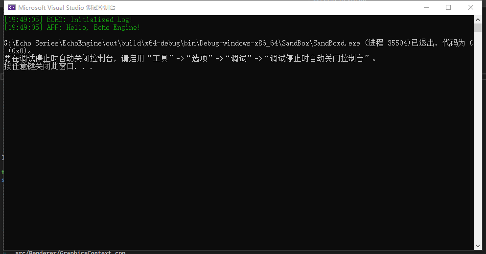

## 项目结构调整

为了进一步提升项目的开发体验，现决定将 EchoEngine 项目分为两个子项目：EchoEngine（渲染引擎核心项目）和 EchoEditor（引擎编辑器项目）。这种划分方法参考了 Unity 引擎的划分方式，即 UnityEngine 为引擎核心，UnityEditor 为引擎编辑器。**当前目标是优先完成 EchoEngine 的构建和功能开发，之后再进行 EchoEditor 的编辑器功能开发。**

---

## Application-应用程序类

在探讨应用程序资源管理时，我们不难发现，高效地管理资源并确保在程序结束时释放资源，是确保应用程序性能和稳定性的关键。在Qt框架中，`QApplication`类扮演着核心角色，它不仅负责应用程序的生命周期管理，还提供了一系列与应用程序相关的功能。因此，我借鉴了 `QApplication` 的设计理念来设计 `Application` 类，以实现EchoEngine能够确保在应用程序的整个生命周期中，资源得到有效管理。

### 设计思路

* **作用：** 用于管理整个应用程序框架的启动和运行过程中的资源（如：主窗口）管理。
* **设计思路：**
  * 对于Application来说，我希望它能够在应用程序启动时能保证当且只有一个应用程序存在，因此使用**单例模式**来设计Application。
  * 在类中，定义一个 `bool` 类型变量用于记录应用程序当前运行状态。
  * 创建新项目名为 `SandBox` ，并设置为启动项，此项目将作为EchoEngine的客户端。
  
  :::note
  1. 由于 `SandBox`作为作为Echo Engine的客户端项目，其必然要在客户端有一个自己的 `Application`类来管理客户端的相关资源，并且这个 `Application`类也要继承于引擎中的 `Application`。
  2. 在客户端中，需要实现引擎端声明的函数 `Application* CreateApplication();`，此函数的作用是将客户端的 `Application`类的指针传递给引擎端。
  :::

### 源码

#### Application

```cpp
// Application.h
namespace Echo {

    /// @brief 应用程序类
    class ECHO_API Application
    {
    public:
        Application(const std::string& sAppName = "Echo Engine");
        virtual ~Application() = default;

    public:
        /// @brief 获取当前应用程序
        /// @return 
        inline static Application& GetApplication() { return *s_Instance; }

        /// @brief 启动应用程序
        void Run();
        /// @brief 关闭应用程序
        void Close();

    private:
        /// @brief 应用程序单例(程序运行时，当且只能有一个应用程序存在)
        static Application* s_Instance;
        /// @brief 运行状态
        bool m_bRunning = false;

    };

    // defined in Client
    Application* CreateApplication();

}

// Application.cpp
namespace Echo {

    Application* Application::s_Instance = nullptr;

    Application::Application(const std::string& sAppName)
    {
        ECHO_CORE_ASSERT(s_Instance != nullptr, "Application already exists!");
        s_Instance = this;
    }

    void Application::Run()
    {
        m_bRunning = true;
    }

    void Application::Close()
    {
        m_bRunning = false;
    }

}
```

#### SandBox

```cpp
// SandBoxApp.cpp
namespace SandBoxApp {
 
    class SandBox : public Echo::Application {
    public:
    SandBox()
    : Echo::Application("SandBoxApp")
    {

    }
    ~SandBox() = default;

 };

} // namespace SandBoxApp

Echo::Application* Echo::CreateApplication()
{
    return new SandBoxApp::SandBox;
}

```

---

## EntryPoint-应用程序入口

`EntryPoint` 是程序执行的起始点。在不同的编程语言和框架中，`EntryPoint` 的实现方式可能有所不同，但其核心功能是一致的：**提供一个明确的入口，让程序从这里开始执行**。

* **桌面应用程序中的EntryPoint**
  在桌面应用程序的开发中，EntryPoint通常与应用程序的主窗口初始化代码紧密相关。以Qt框架为例，QApplication的构造函数和main函数共同构成了程序的EntryPoint。它们负责初始化应用程序，设置必要的参数，并启动事件循环，从而响应用户的交互。
* **EchoEngine中的EntryPoint**
  在本项目中，我们采取了将引擎端和客户端分离的设计策略。这种分离不仅有助于提高代码的模块化，还使得维护和扩展变得更加容易。在这种设计下，EntryPoint被定义为应用程序的初始化代码，即main函数的实现。它位于`Echo`项目中，作为启动整个应用程序的起点。

```cpp
extern Echo::Application* Echo::CreateApplication();

int main(int argc, char** argv)
{
    //初始化日志系统
    Echo::Log::Init();
    ECHO_CORE_INFO("Initialized Log!");
    ECHO_CLIENT_INFO("Hello, Echo Engine!");

    auto app = Echo::CreateApplication();
    app->Run();
    delete app;

    return 0;
}
```

### 测试效果

运行结果如下：



由图中可以看到，相关Log信息已经正常输出。
