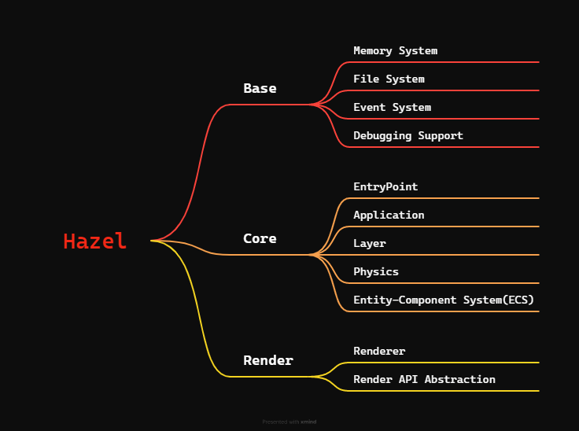
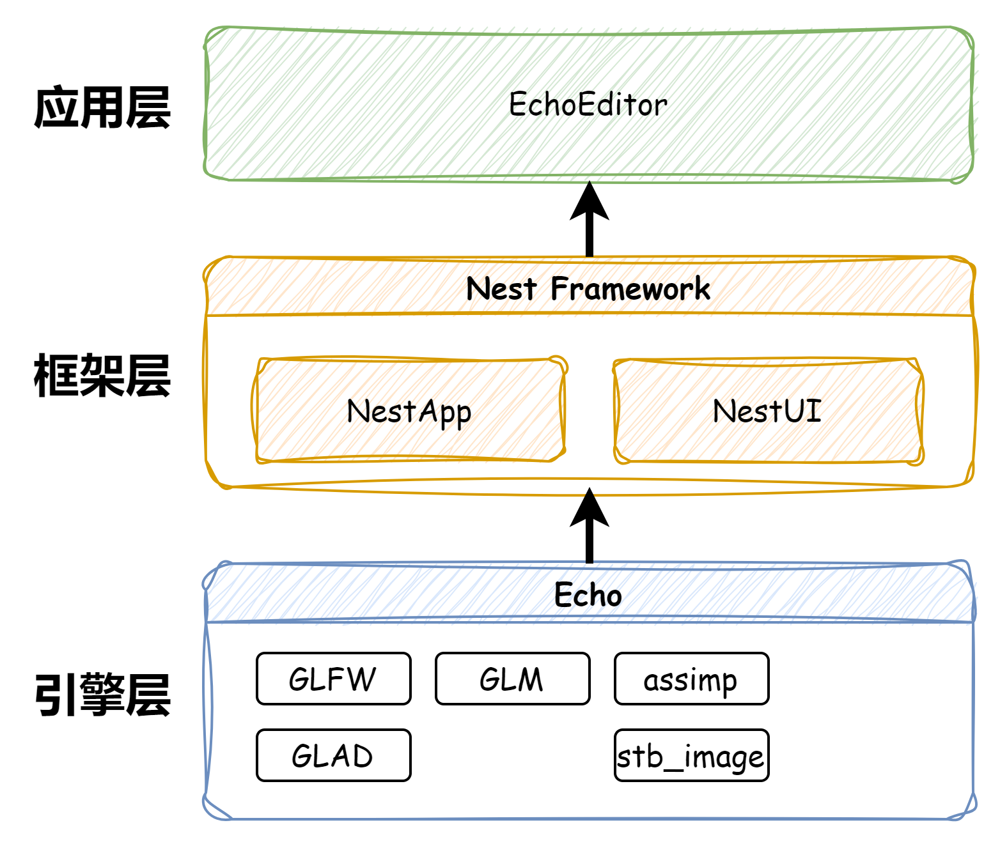

准确来说，EchoEngine这个项目我已经写过两次了，前两次完全是根据Cherno的教程和技术路径来编写的，可以说是完全抄了一遍他的Hazel引擎。因此，我希望在这一次重构项目时，能从零开始，基于自己的设计方案并借鉴CHerno的设计思路，设计出真正属于自己的渲染引擎。在本篇博客中，我将记录EchoEngine的设计思路，为后续开发定下整体方向。

---

## Hazel引擎的设计思路

在记录EchoEngine设计思路之前，我觉得还是得先说Cherno的Hazel引擎是怎么设计的。在Cherno的[DESIGNING our GAME ENGINE](https://youtu.be/etdSXlVjXss?si=Sn9zBWNlenxqmtaE)视频中，他介绍了一个渲染引擎/游戏引擎应该具有哪些功能，拥有哪些功能模块。对于Cherno的Hazel引擎来说，他的设计思路如下图所示。

在图中，我将Cherno列出的设计要点分为了三个层次：Base、Core和Renderer。其中，Base是基础功能，Core是核心功能，而Renderer是渲染功能。后续在设计开发EchoEngine时，也会以这三个层次为基础开始设计。

## EchoEngine设计思路

### 架构设计

在本项目中，我使用了分层架构风格将EchoEngine设计为三个层次：引擎层(Echo)、框架层(Nest)和应用层(EchoEditor)。使用这种架构风格的目标是：**实现引擎不依赖于任何应用程序框架，使其不仅能够独立运行，也可以作为组件嵌入到各种应用程序框架中**。下面我将详细介绍每一层的功能。

#### 引擎层 Echo

Echo是EchoEngine的引擎层，Echo中将设计以下功能模块：

* **基础模块 Base**
  * **事件系统(Event System)**：用于处理各种事件，如键盘、鼠标等
  * **脚本系统(Script System)**：为应用层提供脚本语言的支持，如Lua、C#等
* **渲染模块 Renderer**
  * **图形上下文(Graphics Context)**：用于创建和销毁图形上下文，管理窗口
  * **抽象渲染API**：提供抽象的渲染接口，封装底层的渲染API，如OpenGL、DirectX等
  * **相机系统**：实现相机系统，包括场景相机和编辑器相机等
  * **光照系统**
* **物理系统模块**
* **Layer System**：用于管理应用层中的所有Layer，包括Layer的创建、销毁、添加、移除等

在EchoEngine中，还会使用到以下开源库：

* 使用GLFW用于管理渲染引擎中的渲染上下文
* 使用GLAD提供现代OpenGL的API
* 使用GLM为引擎提供强大的数学运算
* 使用ENTT为引擎实现基于ESC架构的数据管理方法

:::note
**ECS(Entity-Component-System)架构**是一种用于游戏开发和其他实时应用的设计模式，它将游戏对象分解为三个核心部分：

* Entity（实体）：一个唯一的标识符，代表一个游戏对象。
* Component（组件）：数据容器，存储实体的状态和属性。
* System（系统）：逻辑处理单元，对具有特定组件的实体执行操作。

:::

* 使用box2d实现2D物理系统，使用PhysX实现3D物理系统

#### 框架层 Nest

::github{repo="Jerryym/Nest"}
Nest是我自己开发的一个基于 `Qt6.5.3`版本的通用软件开发框架。Nest目前包含了以下两个模块：

* NestApp：Nest框架的核心模块，负责应用程序的启动、应用生命周期的管理和提供日志记录功能等
* NestUI：为Nest框架提供基于Qt的UI组件，负责对于框架中的UI进行管理，如：对于停靠窗口的管理(DockWidgetManager)

在EchoEngine中，Nest框架主要负责应用程序框架的搭建，同时，Nest框架将为本项目提供各类UI组件和日志记录等功能。

#### 应用层 EchoEditor

EchoEditor是EchoEngine的应用层，其作用是提供一个类似于Unity Editor的图形化编辑器应用程序。它将负责EchoEngine的界面设计与交互，同时，EchoEditor将使用Nest框架提供的UI组件来完成界面的搭建。

---

## 参考

* [The Cherno Game Engine Series](https://www.youtube.com/playlist?list=PLlrATfBNZ98dC-V-N3m0Go4deliWHPFwT)
* [osgQt](https://github.com/openscenegraph/osgQt)
* 《Game Engine Architecture, Second Edition》 Jason Gregory
