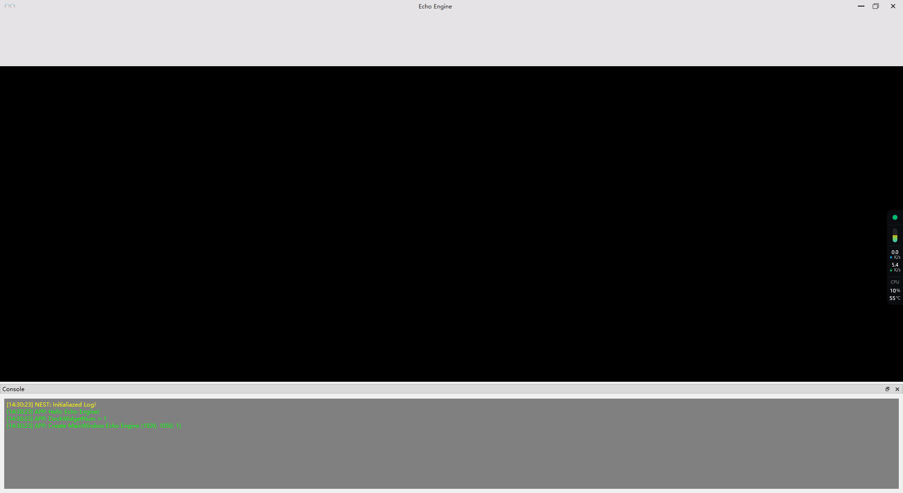

对于渲染引擎来说，UI中的图形显示组件最为重要，因为它是显示渲染结果和与用户进行交互的窗口，所以编写一篇笔记来记录图形显示组件的实现过程是很有必要的。

## GraphicWidget

### 设计思路

* 在EchoEngine中，我设计了一个名为`GraphicWidget`类，此类是用于在EchoEditor中显示图形渲染结果的组件。在一开始时，我是以`QOpenGLWidget`为基类来设计的，但考虑到未来该项目将支持多个图形API，如OpenGL、DirectX、Vulkan等，所以最终我决定使用`QWidget`作为基类。
* 基于目前开发计划是围绕OpenGL来设计的，因此我打算使用GLFW来进行图形上下文管理。

### 实现过程

* 重写两个重要函数：`paintEvent`和`resizeEvent`，在`paintEvent`中绘制图形，在`resizeEvent`中更新窗口大小。
* 重写`paintEngine`函数，返回`nullptr`，表示禁用`QPainter`绘制组件，完全使用渲染引擎来绘制。
* 在构造函数中设置`setAttribute(Qt::WA_PaintOnScreen);`， 用于控制Qt在控件上直接进行绘制操作，而不通过缓冲区（例如双缓冲）进行中间绘制。
* 在`paintEvent`中，获取当前OpenGL上下文，并使用OpenGL来绘制图形，最后交换缓冲区将渲染结果显示到屏幕上。

```cpp
// GraphicWidget.h
#pragma once

struct GLFWwindow;

namespace EchoEditor {

    /// @brief 图形显示组件
    class GraphicWidget : public QWidget
    {
        Q_OBJECT
    public:
        GraphicWidget(uint32_t nWidth, uint32_t nHeight, QWidget* parent = nullptr);
        virtual ~GraphicWidget();

    public:
        virtual void paintEvent(QPaintEvent* event) override;
        virtual void resizeEvent(QResizeEvent* event) override;

        /// @brief 获取绘制引擎
        /// @return 返回nullptr：表示禁用QPainter绘制组件，完全使用渲染引擎来绘制
        virtual QPaintEngine* paintEngine() const override { return nullptr; }

    private:
        /// @brief 初始化
        void Initialize();

    private:
        GLFWwindow* m_pWindow = nullptr;
    };

}

// GraphicWidget.cpp
#include "pch.h"
#include "GraphicWidget.h"

#include <GLFW/glfw3.h>
#include <glad/glad.h>

namespace EchoEditor {

    static bool s_bGLFWInitialiazed = false;

    GraphicWidget::GraphicWidget(uint32_t nWidth, uint32_t nHeight, QWidget* parent)
        : QWidget(parent)
    {
        // 设置直接绘制在屏幕上
        setAttribute(Qt::WA_PaintOnScreen);
        // 设置大小
        resize((int)nWidth, (int)nHeight);
        // 初始化
        Initialize();
    }

    GraphicWidget::~GraphicWidget()
    {
        glfwDestroyWindow(m_pWindow);
    }

    void GraphicWidget::paintEvent(QPaintEvent* event)
    {
        //设置当前上下文
        glfwMakeContextCurrent(m_pWindow);

        // OpenGL rendering here
        glClearColor(0.1f, 0.1f, 0.1f, 1.0f);
        glClear(GL_COLOR_BUFFER_BIT);

        // 交换缓冲区
        glfwSwapBuffers(m_pWindow);
    }

    void GraphicWidget::resizeEvent(QResizeEvent* event)
    {
    }

    void GraphicWidget::Initialize()
    {
        if (!s_bGLFWInitialiazed)
        {
            // glfwTerminate on system shutdown
            int success = glfwInit();
            ECHO_CORE_ASSERT(success, "Could not intialiaz GLFW!");
            s_bGLFWInitialiazed = true;
        }
        glfwWindowHint(GLFW_VISIBLE, GLFW_FALSE);
        m_pWindow = glfwCreateWindow(width(), height(), "EchoEngine", nullptr, nullptr);
        glfwMakeContextCurrent(m_pWindow);

        //初始化GLAD
        int iStatus = gladLoadGLLoader((GLADloadproc)glfwGetProcAddress);
        ECHO_CORE_ASSERT(iStatus, "Failed to initiazlize Glad!");
        //设置垂直同步
        glfwSwapInterval(1);
    }

}
```

### 测试效果



由图中可以看到，图形显示组件已经成功将组件的背景色设置为深灰色！

---

## Reference

* [Qt入门DirectX11学习之旅(三) QT中用QWidget来显示绘制DirectX11窗口 - 帛玉象的文章 - 知乎](https://zhuanlan.zhihu.com/p/103687269)
* [Qt入门DirectX11学习之旅(四)  画个三角形 - 帛玉象的文章 - 知乎](https://zhuanlan.zhihu.com/p/103709917)
