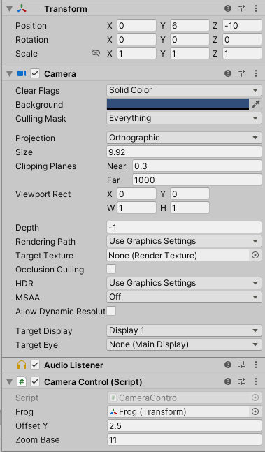

结合[Michael老师](https://space.bilibili.com/370283072)在B站上的课程[《Unity休闲手机游戏开发》](https://www.bilibili.com/cheese/play/ss978?bsource=link_copy)，开发了一款简单的竖屏小游戏，并命名为CrossRoad。以此项目为契机，实现熟悉unity相关操作，了解游戏开发流程等目标。在这篇博客中，将一些在开发中遇到的一些困难点、运用到的技术点记录下来，以便日后回顾。

* **项目仓库：**[CrossRoad](https://github.com/Jerryym/CrossRoad)
* **玩法：** 在这个游戏中，我们通过点按/长按屏幕控制青蛙向前跳跃、根据点按位置控制青蛙左右移动。在游戏场景中，有公路、草地和小河三种场景。在公路场景中，会有移动的车辆；在草地场景中，会有障碍物（栅栏、石墙）；在小河场景中，会有移动的木板。当青蛙碰撞到汽车、栅栏、石墙，亦或是穿越小河时，掉入水中，都会判定失败。
  

---

## 设置相机

由于这是一款2D竖版游戏，所以我希望整个游戏的渲染能以Y轴的坐标为标准，即当两个模型发现重叠时，Y轴越小显示在前面，Y轴越大的显示在后面。
因此，在菜单栏中选择**Edit->Project Settings**中，选择**Graphics**，将Carema Settings中的**Transparency Sort Mode（透明排序模式）**设置为**Custom Axis（自定义轴）**，并将X轴设置为0，Y轴设置为1，Z轴设置为0，如下图所示。


这样，我们就能够实现在游戏中当两个模型重叠时，Y轴越小显示在前面，Y轴越大的显示在后面的效果。

## Input System

根据玩法，我给青蛙设计了如下图所示的Input System，并给青蛙添加对应的**Player Input**组件。


1. Jump/Long Jump：Action Type = Button
2. Touch Position：Action Type = Value，Control Type = Vector2
   > 因为要获取到所点击的屏幕上位置点，所以通过Vector2一个二维向量存储数据
   >

根据对应的Action，编写对应的事件函数，并赋予到对应的动作上

```csharp
#region Input Event
/// <summary>
/// 点按跳跃
/// </summary>
/// <param name="context"></param>
public void Jump(InputAction.CallbackContext context)
{
    if (context.performed && m_bIsJump == false)
    {
        //跳跃的距离
        m_MoveDistance = jumpDistance;
        //执行跳跃
        m_bCanJump = true;

        //仅当向上跳跃时记录分数
        if (m_enDir == enDirection.enUP)
        {
            m_iTotalScore += stepScore;
        }
    }
}

/// <summary>
/// 长按跳跃
/// </summary>
/// <param name="context"></param>
public void LongJump(InputAction.CallbackContext context)
{
    if (context.performed && m_bIsJump == false)
    {
        m_MoveDistance = jumpDistance * 2;
        m_bHold = true;
    }

    //长按结束且处于当前为长按状态
    if (context.canceled && m_bHold && m_bIsJump == false)
    {
        m_bCanJump = true;
        m_bHold = false;

        //仅当向上跳跃时记录分数
        if (m_enDir == enDirection.enUP)
        {
            m_iTotalScore += stepScore * 2;
        }
    }
}

/// <summary>
/// 获取点击的点坐标
/// </summary>
/// <param name="context"></param>
public void GetTouchPosition(InputAction.CallbackContext context)
{
    if (context.performed)
    {
        m_TouchPosition = Camera.main.ScreenToWorldPoint(context.ReadValue<Vector2>());
        var offset = ((Vector3)m_TouchPosition - transform.position).normalized;
        if (Mathf.Abs(offset.x) <= 0.7f)
        {
            m_enDir = enDirection.enUP;
        }
        else if (offset.x < 0)
        {
            m_enDir = enDirection.enLeft;
        }
        else if (offset.x > 0)
        {
            m_enDir = enDirection.enRight;
        }
    }
}
#endregion
```


## 自适应相机控制

由于手机屏幕尺寸都各不相同，因此为了保证游戏在不同型号的手机上运行时都能保证充满整个屏幕，我们需要对主相机进行一定的设置，使它能够根据屏幕尺寸的不同去调整整个显示效果。

```csharp
public class CameraControl : MonoBehaviour
{
    /// <summary>
    /// 获取Frog对应的Transform组件
    /// </summary>
    public Transform Frog;

    /// <summary>
    /// Y轴偏移量
    /// </summary>
    public float offsetY;

    /// <summary>
    /// 相机默认缩放大小
    /// </summary>
    public float zoomBase;

    /// <summary>
    /// 屏幕比例
    /// </summary>
    private float m_rRatio;

    /// <summary>
    ///
    /// </summary>
    private void Start()
    {
        m_rRatio = (float)Screen.height/ (float)Screen.width;
        Camera.main.orthographicSize = zoomBase * m_rRatio * 0.5f;
    }

    /// <summary>
    /// 更新
    /// </summary>
    private void LateUpdate()
    {
        float rPositionY = Frog.transform.position.y + offsetY * m_rRatio;
        transform.position = new Vector3(transform.position.x, rPositionY, transform.position.z);
    }
}
```



1. 首先我们设置了一个zoomBase变量，用来设置相机默认缩放大小，在这里我设置为了11。
2. 其次通过Unity内置的Screen对象，获取当前屏幕的比例（屏幕比例 = 屏幕高度 / 屏幕宽度），**注意Screen.height和Screen.width的返回值默认为int**。
3. 最后，根据青蛙当前的坐标位置 + （Y轴的偏置值 * 屏幕比例），获取当前相机的位置。

## 预制体（Prefabs）

预制体即预先设置好的物体，用来保存单个游戏物体的信息的，可以让我们便捷地在其他场景或其他工程中来使用这个游戏物体，类似于物体模板。
实例化预制体：

```csharp
Instantiate(gameobject, transform.position, Quaternion.identity);
```

## C#委托机制（Action Delegate）

为了避免整个游戏的代码过于耦合，Michael老师提出通过使用C#委托机制实现游戏内部事件的相互通讯。

* 那么什么是委托呢？

> 原文链接：[c# 四种委托的区别【delegate 、action、func和predicate 】](https://blog.csdn.net/qq_39024280/article/details/122814391)
> 委托是一种动态调用方法的类型，属于引用型。
> 委托是对方法的抽象和封装。委托对象实质上代表了方法的引用（即内存地址）
>
> 特点：
>
> 1. 委托类似于C++函数指针，但与指针不同的是，委托是完全面向对象的，是安全的数据类型。
> 2. 委托允许将方法作为参数进行传递。
> 3. 委托可用于定义回调方法。
> 4. 委托可以把多个方法链接在一起。这样，在事件触发时可同时启动多个事件处理程序。
> 5. 委托签名不需要与方法精确匹配。
>
> C#四种委托的异同？
>
> 1. delegate ,至少0个参数，至多32个参数，可以无返回值，可以指定返回值类型
> 2. Action ,至少0个参数，无返回值的泛型委托
> 3. Func ,至少0个参数，至多16个参数，必须有返回值的泛型委托
> 4. Predicate ,有且只有一个参数，返回值只为 bool 类型

在本项目中，我们使用了**Action**委托，用于处理得分事件、死亡游戏结束事件。通过调用Action中的 `Invoke()`或 `Invoke(arg)`，调用它所指向的方法。

```csharp
using System;
using System.Collections;
using System.Collections.Generic;
using Unity.VisualScripting;
using UnityEngine;

public class EventHandler
{
    /// <summary>
    /// 得分事件
    /// </summary>
    public static event Action<int> GetScoreEvent;
    public static void CallGetScoreEvent(int iScore)
    {
        if (GetScoreEvent != null)
        {
            GetScoreEvent.Invoke(iScore);
        }
    }

    /// <summary>
    /// 死亡游戏结束事件
    /// </summary>
    public static event Action GameOverEvent;
    public static void CallGameOverEvent()
    {
        if (GameOverEvent != null)
        {
            GameOverEvent.Invoke();
        }
    }
}
```

## 利用Json持久化保存数据

为了实现记录每次游戏的成绩，并取前7次成绩显示在排行榜中。课程中选择使用**newtonsoft-json**插件，通过json文件的形式记录游戏成绩。

```csharp
using System.Collections;
using System.Collections.Generic;
using System.IO;
using Newtonsoft.Json;
using UnityEngine;

public class GameManager : MonoBehaviour
{
    public static GameManager instance;

    /// <summary>
    /// 分数表
    /// 排序：从大到小
    /// </summary>
    public List<int> m_scoreList;
    /// <summary>
    /// 当前分数
    /// </summary>
    private int m_iScore;
    /// <summary>
    /// 保存文件的路径
    /// </summary>
    private string m_dataPath;

    private void Awake()
    {
        if (instance == null)
        {
            instance = this;
        }
        else
        {
            Destroy(this.gameObject);
        }

        m_dataPath = Application.persistentDataPath + "/LeaderBoard.json";
        m_scoreList = GetScoreListData();
        DontDestroyOnLoad(this);
    }

    private void OnEnable()
    {
        EventHandler.GameOverEvent += OnGameOverEvent;
        EventHandler.GetScoreEvent += OnGetScoreEvent;
    }

    private void OnDisable()
    {
        EventHandler.GameOverEvent -= OnGameOverEvent;
        EventHandler.GetScoreEvent -= OnGetScoreEvent;
    }

    private void OnGetScoreEvent(int iScore)
    {
        m_iScore = iScore;
    }

    private void OnGameOverEvent()
    {
        //相同分数不重复记录
        if (m_scoreList.Contains(m_iScore) == false)
        {
            m_scoreList.Add(m_iScore);
        }

        m_scoreList.Sort((x, y) => -x.CompareTo(y));//降序
        File.WriteAllText(m_dataPath, JsonConvert.SerializeObject(m_scoreList));
    }

    /// <summary>
    /// 获取json中数据
    /// </summary>
    /// <returns></returns>
    public List<int> GetScoreListData()
    {
        if (File.Exists(m_dataPath) == true)
        {
            string jsonData = File.ReadAllText(m_dataPath);
            return JsonConvert.DeserializeObject<List<int>>(jsonData);
        }
        return new List<int> { 0 };
    }
}
```

---

## 总结

通过《Unity休闲手机游戏开发》课程，基本熟悉Unity相关操作，学习并实践了基于C#语言的开发，之前一直都是做C++做开发的 (￣▽￣)"。这个课程仅仅是学习游戏开发的开始，后面还有很多需要学习的知识！

进击のJerry，继续努力吧！
