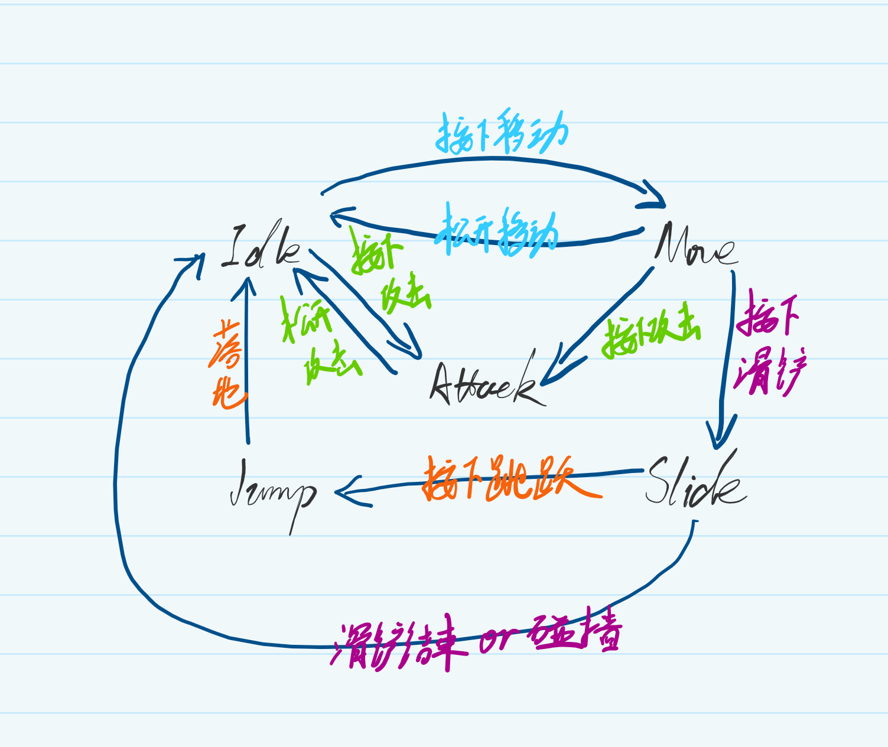

在我个人的[EndlessJourney](https://github.com/Jerryym/EndlessJourney)项目中，我正在构建一个2D动作角色系统。随着角色功能的增加，包括跳跃、滑铲、下蹲、攻击、受击等动作，我发现`PlayerController`中维护的状态变量也越来越多：

```csharp
private bool m_isJump;
private bool m_isSlide;
private bool m_isSquat;
private bool m_isAttack;
private bool m_isHurt;
...
```

虽然这种方式在简单场景下可以工作，但随着状态数量的增加，代码会变得难以维护和扩展。状态判断混在一起、条件分支不断增多、行为耦合严重，一旦新增动作或调整逻辑，很容易引发连锁bug。
在查阅了实际游戏开发案例和相关技术资料之后，我发现一个更合理、更工程化的解决方式——有限状态机(Finite State Machine, FSM)。它能够将每种行为拆分为独立状态，使角色逻辑更加清晰、易维护，同时具备良好的扩展性。

## 什么是有限状态机

FSM是一种将对象行为划分为**有限个状态**、并管理它们之间切换关系的模型。其特点如下：

* 每次只能处于一个状态(eg: Idle/Jump/Attack)
* 每个状态负责自己的逻辑(OnEnter/OnLogictUpdate/OnPhysicsUpdate/OnExit)
* 状态切换流程清晰，可避免过多的`if-else`条件判断

---

## 构建有限状态机

既然选择使用有限状态机，那么要先设计一套通用的状态机结构，用于统一管理角色的行为状态。首先，定义一个状态接口`IState`，声明所有状态需要实现的生命周期方法：

```csharp
/// <summary>
/// 状态机接口类: 定义了所有状态类必须实现的生命周期方法, 实现了逻辑更新、物理更新
/// </summary>
public interface IState
{
    /// <summary>
    /// 状态进入时调用: 用于初始化状态
    /// </summary>
    void OnEnter();
    /// <summary>
    /// 状态逻辑更新: 在 Unity 的 Update() 中调用, 用于处理输入、游戏逻辑、状态转换(SwitchState)等操作
    /// </summary>
    void OnLogicUpdate();
    /// <summary>
    /// 状态物理更新: 在 Unity 的 FixedUpdate() 中调用, 用于给gameObject施加力、修改速度等操作
    /// </summary>
    void OnPhysicsUpdate();
    /// <summary>
    /// 状态退出时调用: 用于清理资源、停止动画等
    /// </summary>
    void OnExit();
}
```

接下来，实现状态机基类，用于存储当前状态并负责状态切换和更新调用：

```csharp
/// <summary>
/// 状态机基类
/// </summary>
public class StateMachine
{
    /// <summary>
    /// 当前状态
    /// </summary>
    public IState currentState;

    public virtual void Update()
    {
        currentState?.OnLogicUpdate();
    }

    public virtual void FixedUpdate()
    {
        currentState?.OnPhysicsUpdate();
    }

    /// <summary>
    /// 切换状态
    /// </summary>
    /// <param name="newState">新状态</param>
    protected void SwitchState(IState newState)
    {
        if (newState == currentState)
        {
            return;
        }

        //退出当前状态
        currentState?.OnExit();
        //更新状态
        currentState = newState;
        //初始化新状态
        currentState.OnEnter();
    }
}
```

---

## 给 Player 构建状态机

### 设计 Player 的状态

在项目中，我根据手中的美术素材，将角色分为7种状态：Idle、Move-移动(包括行走和奔跑)、Jump、Slide、Squat、Attack-攻击(包括多段攻击)、Hurt。其状态关系如下：



为了让状态机在代码层面更直观，我定义了一个枚举来描述这些状态：

```csharp
/// <summary>
/// Player状态枚举
/// </summary>
public enum PlayerStateEnum
{
    None = -1,
    Idle,
    Move,
    Jump,
    Squat,
    Slide,
    Attack,
    Hurt
}
```

### 将状态机与控制器绑定

在项目中，我将角色的逻辑分为三个部分：

1. `PlayerController`: 角色控制器，负责角色的输入、与角色数据交互、事件响应等
2. `PlayerAnimationController`: 角色动画控制器，负责动画播放和动画参数更新
3. `PlayerStateMachine`: 角色状态机，负责状态的切换和状态的逻辑更新

并且在`PlayerStateMachine`中，同时存储角色控制器和动画控制器的引用，实现通过状态机同时读写角色数据与更新动画：

```csharp
/// <summary>
/// Player状态机
/// </summary>
public class PlayerStateMachine : StateMachine
{
    /// <summary>
    /// Player控制器
    /// </summary>
    public PlayerController Controller => m_controller;
    private PlayerController m_controller;

    /// <summary>
    /// Player动画控制器
    /// </summary>
    public PlayerAnimationController AnimationController => m_animationController;
    private PlayerAnimationController m_animationController;

    /// <summary>
    /// 状态字典
    /// </summary>
    private Dictionary<PlayerStateEnum, PlayerState> m_stateDic;

    public PlayerStateMachine(PlayerController controller, PlayerAnimationController animationController)
    {
        this.m_controller = controller;
        this.m_animationController = animationController;
        m_stateDic = new Dictionary<PlayerStateEnum, PlayerState>();
    }

    /// <summary>
    /// 添加状态
    /// </summary>
    /// <param name="stateEnum"></param>
    /// <param name="playerState"></param>
    public void AddState(PlayerStateEnum stateEnum, PlayerState playerState)
    {
        if (m_stateDic.ContainsKey(stateEnum) != true)
        {
            m_stateDic.Add(stateEnum, playerState);
        }
    }

    public void SwitchState(PlayerStateEnum state)
    {
        if (m_stateDic.TryGetValue(state, out var playerState) != true)
        {
            return;
        }

        //切换状态
        base.SwitchState(playerState);
    }
}
```

在`PlayerController`中初始化状态机，并将每个状态注册进去：

```csharp
/// <summary>
/// 初始化状态机
/// </summary>
private void InitStateMachine()
{
    m_stateMachine = new PlayerStateMachine(this, GetComponent<PlayerAnimationController>());
    //Idle
    m_stateMachine.AddState(PlayerStateEnum.Idle, new PlayerIdleState(m_stateMachine));
    //Move
    m_stateMachine.AddState(PlayerStateEnum.Move, new PlayerMoveState(m_stateMachine));
    //Jump
    m_stateMachine.AddState(PlayerStateEnum.Jump, new PlayerJumpState(m_stateMachine));
    //Squat
    m_stateMachine.AddState(PlayerStateEnum.Squat, new PlayerSquatState(m_stateMachine));
    //Slide
    m_stateMachine.AddState(PlayerStateEnum.Slide, new PlayerSlideState(m_stateMachine));
    //Attack
    m_stateMachine.AddState(PlayerStateEnum.Attack, new PlayerAttackState(m_stateMachine));
    //Hurt
    m_stateMachine.AddState(PlayerStateEnum.Hurt, new PlayerHurtState(m_stateMachine));

    //初始化默认状态为Idle
    m_stateMachine.SwitchState(PlayerStateEnum.Idle);
}
```

### Example：Idle状态

由于Idle状态的逻辑比较简单，下面我以Idle状态为例，介绍状态机的状态转换逻辑：

* 当角色的输入方向大于0.1时，切换为Move状态
* 当角色按下跳跃键时，切换为Jump状态
* 当角色按下下蹲键时，切换为Squat状态
* 当角色按下滑铲键时，切换为Slide状态

```csharp
public class PlayerIdleState : PlayerState
{
    public PlayerIdleState(PlayerStateMachine stateMachine) : base(stateMachine)
    {
        base.stateEnum = PlayerStateEnum.Idle;
    }

    public override void OnLogicUpdate()
    {
        var controller = stateMachine.Controller;
        //移动
        if (controller.inputDirection.magnitude > 0.1f)
        {
            stateMachine.SwitchState(PlayerStateEnum.Move);
            return;
        }

        //跳跃
        if (controller.IsOnGround && controller.IsJump)
        {
            stateMachine.SwitchState(PlayerStateEnum.Jump);
            return;
        }

        //下蹲
        if (controller.IsOnGround && controller.IsSquat)
        {
            stateMachine.SwitchState(PlayerStateEnum.Squat);
            return;
        }

        //滑铲
        if (controller.IsOnGround && controller.IsSlide)
        {
            stateMachine.SwitchState(PlayerStateEnum.Slide);
            return;
        }

        //攻击
        if (controller.IsOnGround && controller.IsAttack)
        {
            stateMachine.SwitchState(PlayerStateEnum.Attack);
            return;
        }
    }

    public override void OnPhysicsUpdate()
    {
        stateMachine.Controller.SetVelocity(Vector2.zero);
    }
}
```

## 效果

<!-- markdownlint-disable-next-line MD033 -->
<iframe width="100%" height="468" src="/videos/GameDev/Player状态机.mp4" title="Player状态机" frameborder="0" allowfullscreen></iframe>

---

## 总结

项目中通过引用有限状态机，实现角色控制系统，有效管理了角色的状态切换、动画播放和物理行为控制等核心功能。但从整个项目结构来看，仍然存在一些问题，如：

1. 当前`PlayerController`中仍存在用于标识角色状态的bool类型，与FSM存在冗余
2. 动画播放仍依赖Unity Animator内的状态连线，导致复杂状态(如多段攻击)在动画流转控制上存在不便与潜在冲突

为进一步优化架构与提升项目可维护性，项目后续会进行如下改进：

* **移除多余的状态标识符：** 通过状态机直接控制角色状态，减少PlayerController中的bool变量，提高代码可维护性
* **取消Animator内部手动连线：** 通过状态机直接控制动画播放，实现动画事件触发与状态切换的统一管理

---

## Reference

* [概述Unity中FSM-有限状态机的实现方法与使用](https://zhuanlan.zhihu.com/p/669072258)
* [行为树的理论与实践入门](https://zhuanlan.zhihu.com/p/611393851)
