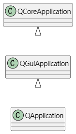
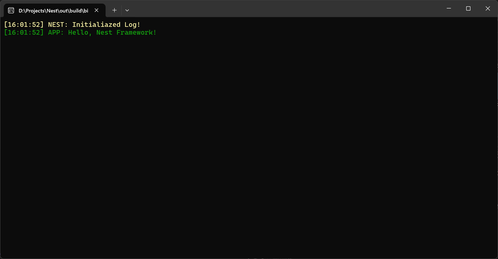

**Nest**是我当前正在开发的一个基于 `Qt6.5.3`的通用软件开发框架项目。本项目的主要目的是深入学习Qt的特性，掌握跨平台应用的开发流程，为未来可能会用到的技术点积累经验。**NestApp**模块作为框架的核心，在整个Nest项目中扮演重要角色，其职责包括应用程序的启动、应用生命周期的管理以及日志记录等。

在本篇博客中，我将重点介绍**NestApp**模块的设计与实现，并说明如何设计应用程序类，如何利用spdlog库设计框架的日志功能。

**项目仓库**：

::github{repo="Jerryym/Nest"}

---

## NestApp模块概述

### 模块职责

* 作为Nest框架的核心模块
* 负责应用程序的启动、应用生命周期的管理和提供日志记录功能等

### Application-应用程序类

* **作用**

  用于管理整个应用程序框架的启动和运行过程中的资源（如：主窗口）管理。
* **设计思路**

  * 由于Nest框架是基于Qt框架开发的，因此在设计 `Application`时应继承Qt中相关的Application类。
  * 对于Application来说，我希望它能够在应用程序启动时能保证当且只有一个应用程序存在，因此使用**单例模式**来设计Application。
  * 在类中，定义一个 `bool`类型变量用于记录应用程序当前运行状态，定义一个 `QMainWindow`类指针用于管理应用程序对应的主窗口。

    :::note

    #### Qt中的Application

    1. 在Qt中，一共有三种Application：`QCoreApplication`、`QGuiApplication`和 `QApplication`
    2. 三种Application类之间的关系如图所示
       
    3. 区别：
       1. `QCoreApplication`定义在 `core`模块中，为应用程序提供了一个非gui的事件循环。
       2. `QGuiApplication`定义在 `gui`模块中，提供了额外的gui相关的设置，比如桌面设置，风格，字体，调色板，剪切板，光标。
       3. `QApplication`定义在 `widgets`模块中，是QWidget相关的，能设置双击间隔，按键间隔，拖拽距离和时间，滚轮滚动行数等，能获取桌面，激活的窗口，模式控件，弹跳控件等。
    :::
* **实现**

  结合上述的设计思路进行具体的代码实现：

  * 定义 `Applicaiton`继承 `QApplication`，使其不仅可以管理Qt的应用程序还可以对应用程序的主窗口资源进行管理。
  * 在类中使用宏 `Q_OBJECT`，使得 `Applicaiton`能够使用Qt中的信号和槽机制。
  * 基于单例设计模式，定义静态变量 `static Application* s_Instance`，确保程序运行时仅有一个应用程序存在。
  * 定义变量 `std::unique_ptr<QMainWindow> m_Window`用于管理应用程序关联的主窗口，并且通过智能指针 `std::unique_ptr`独占所管理对象的所有权，确保应用程序运行时只有一个主窗口资源和在程序运行结束时自动释放资源。

    :::note

    #### C++智能指针

    C++标注库中提供了三种常用的智能指针(**使用时请添加头文件 `#include <memory>`**)：`std::unique_ptr`、`std::shared_ptr`和 `std::weak_ptr`。利用智能指针管理原始指针，可以帮助我们在开发过程中减少内存泄漏，空指针和重复释放等问题的发生。

    * `std::unique_ptr`
      * `std::unique_ptr`是智能指针中最严格的指针，负责管理动态分配的内存，并且保证同一时刻只有一个 `unique_ptr`拥有该内存的所有权。`std::unique_ptr`**不允许复制**，但可以转移所有权（通过 `std::move`）。一旦 `std::unique_ptr`超出作用域，它会自动释放资源，避免内存泄漏。
      * 特点：
        * 独占所有权（不能复制，仅能移动）
        * 自动管理资源释放
        * 适用于单一所有权场景
    * `std::shared_ptr`
      * `std::shared_ptr`是一个具有共享所有权的智能指针。多个 `std::shared_ptr`可以共享同一个资源，当最后一个 `std::shared_ptr`被销毁时，资源才会被释放。它内部使用引用计数来跟踪多少个 `std::shared_ptr`对象共享相同的资源。
      * 特点：
        * 多个指针可以共享同一资源
        * 通过引用计数管理资源
        * 自动释放内存（**当引用计数为0时**）
    * `std::weak_ptr`
      * `std::weak_ptr`是对 `std::shared_ptr`的辅助工具，用来打破循环引用。`std::weak_ptr`不增加引用计数，它可以从 `std::shared_ptr`获得一个“非拥有”的指针。在某些场景下，`std::weak_ptr`用于避免 `std::shared_ptr`之间的循环引用问题。
      * 特点：
        * 不增加引用计数
        * 用来解决 `std::shared_ptr`之间的循环引用问题
        * 可以安全地转换为 `std::shared_ptr`
    :::
* **代码**

```c++
//Application.h
namespace NestApp {

    /// @brief 应用程序类
    class NESTAPP_API Application : public QApplication
    {
        Q_OBJECT
    public:
        Application(int& argc, char** argv);
        virtual ~Application() {}

        /// @brief 运行应用程序
        virtual void Run();

    public:
        /// @brief 获取当前应用程序
        /// @return 
        inline static Application& GetApplication() { return *s_Instance; }

        /// @brief 设置主窗口
        /// @param mainWindow 
        static void SetMainWindow(QMainWindow* mainWindow);

        /// @brief 获取主窗口
        /// @return 当前活动窗口指针
        inline QMainWindow* GetMainWindow() { return m_Window.get(); }

    private:
        std::unique_ptr<QMainWindow> m_Window; //应用程序主窗口
        bool m_bRunning = true;     //运行状态的控制

        /// @brief 应用程序单例: 程序运行时，当且只能一个应用程序存在
        static Application* s_Instance;
    };

}

//Application.cpp
namespace NestApp {

    Application* Application::s_Instance = nullptr;

    Application::Application(int& argc, char** argv)
    : QApplication(argc, argv)
    {
        s_Instance = this;
    }

    void Application::Run()
    {
        //启动主窗口
        m_Window.get()->show();
    }

    void Application::SetMainWindow(QMainWindow* mainWindow)
    {
        s_Instance->m_Window.reset(mainWindow);
    }

}
```

---

### Log-日志类

我们在软件开发过程中，经常会遇到需要跟踪和记录应用程序的状态和行为的情况。当应用程序变得复杂，出现了更多的错误、警告和信息时，手动输出到控制台或文件就不够高效和方便了。因此，有一个可靠的日志系统是非常重要的。

* **功能设计**

  对于Log来说，我们希望其具有以下功能和特性：

  * 支持多种日志级别，如调试、信息、警告、错误等。
  * 支持日志格式化输出，允许自定义日志消息的格式。

    :::tip

    #### 日志级别一般分为以下几种（从高到低排序）

    * **FATAL（致命）**： FATAL级别的日志用于记录严重的错误，通常表示应用程序遇到了无法继续运行的情况，可能会导致应用程序崩溃。这些日志级别用于标识需要立即处理的严重问题。
    * **ERROR（错误）**：ERROR级别的日志用于记录错误情况，例如操作失败、异常抛出等。这些日志表明应用程序遇到了一些问题，但通常不会导致应用程序崩溃。ERROR级别的日志在生产环境中非常重要，以及时发现和修复错误。
    * **WARN（警告）**：WARNING级别的日志用于记录警告信息，例如潜在的问题或不正常的情况，但不会导致应用程序终止。这些日志可以帮助监控和排查问题。
    * **INFO（通知）**：INFO级别的日志用于记录应用程序的一般信息，例如应用程序启动、关键事件、操作完成等。这些日志对于了解应用程序的运行状态和性能是有用的，通常会在生产环境中启用。
    * **DEBUG（调试）**：DEBUG级别的日志用于记录应用程序的调试信息，例如变量的值、函数的执行路径等。它有助于开发人员查找和修复问题。DEBUG级别的日志在开发和测试阶段启用，但在生产环境中通常禁用，因为它可能会产生大量的输出。
    * **TRACE（跟踪）**：这是最详细的日志级别，通常用于记录应用程序中最细微的操作和事件，以帮助调试和追踪问题。TRACE级别的日志包含非常详细的信息，通常只在开发和调试阶段启用。

    :::
* **常用C++ Log库**
  * spdlog：一个快速，灵活且易于使用的日志库。它支持多线程，并且可以定制日志格式。
  * boost.log：是 boost 库的一部分，提供了强大的日志功能，包括多级日志，日志记录过滤器和异步日志。
  * log4cxx：是 Apache 的一个项目，是一个功能强大的日志库，支持多级日志，日志记录过滤器，异步日志和 XML 配置。
  * glog：是 Google 开发的日志库，支持多线程，提供了命令行选项来配置日志记录，并支持在运行时动态更改日志级别。
  * Poco Logging Library：是 Poco C++ 库的一部分，提供了简单的日志记录功能，并且可以很容易地扩展。
* **实现**
  * 基于高性能、异步、易用性等特点，我最终选择[spdlog](https://github.com/gabime/spdlog)作为框架中Log模块的基础。
  * 设计一个类名为 `Log`，在类中声明两个静态指针分配管理框架日志对象和客户端日志对象。
  * 根据日志级别，分别定义了框架和客户端的**跟踪、信息、警告、错误、致命**等级的宏。
* **代码**

  ```c++
  //Log.h
  namespace NestApp {

      /// @brief 日志
      class Log
      {
      public:
          /// @brief 初始化日志系统
          static void Init();

          /// @brief 获取框架日志
          /// @return 
          inline static std::shared_ptr<spdlog::logger>& GetCoreLogger() { return s_CoreLogger; }

          /// @brief 获取客户端日志
          /// @return 
          inline static std::shared_ptr<spdlog::logger>& GetClientLogger() { return s_ClientLogger; }

      private:
          static std::shared_ptr<spdlog::logger> s_CoreLogger;  // 框架日志对象(智能指针)
          static std::shared_ptr<spdlog::logger> s_ClientLogger;  // 客户端日志对象(智能指针)
      };

  }   

  // Core log macros
  #define NEST_CORE_TRACE(...)        ::NestApp::Log::GetCoreLogger()->trace(__VA_ARGS__)
  #define NEST_CORE_INFO(...)         ::NestApp::Log::GetCoreLogger()->info(__VA_ARGS__)
  #define NEST_CORE_WARN(...)         ::NestApp::Log::GetCoreLogger()->warn(__VA_ARGS__)
  #define NEST_CORE_ERROR(...)        ::NestApp::Log::GetCoreLogger()->error(__VA_ARGS__)
  #define NEST_CORE_CRITICAL(...)     ::NestApp::Log::GetCoreLogger()->critical(__VA_ARGS__)

  // Client log macros
  #define NEST_CLIENT_TRACE(...)      ::NestApp::Log::GetClientLogger()->trace(__VA_ARGS__)
  #define NEST_CLIENT_INFO(...)       ::NestApp::Log::GetClientLogger()->info(__VA_ARGS__)
  #define NEST_CLIENT_WARN(...)       ::NestApp::Log::GetClientLogger()->warn(__VA_ARGS__)
  #define NEST_CLIENT_ERROR(...)      ::NestApp::Log::GetClientLogger()->error(__VA_ARGS__)
  #define NEST_CLIENT_CRITICAL(...)   ::NestApp::Log::GetClientLogger()->critical(__VA_ARGS__)


  //Log.cpp
  namespace NestApp {

      std::shared_ptr<spdlog::logger> Log::s_CoreLogger;
      std::shared_ptr<spdlog::logger> Log::s_ClientLogger;

      void Log::Init()
      {
          // 更改日志模式
          spdlog::set_pattern("%^[%T] %n: %v%$");

          // 初始化框架日志对象的颜色和等级
          s_CoreLogger = spdlog::stdout_color_mt("NEST");
          s_CoreLogger->set_level(spdlog::level::trace);

          // 初始化客户端日志对象的颜色和等级
          s_ClientLogger = spdlog::stdout_color_mt("APP");
          s_ClientLogger->set_level(spdlog::level::trace);
      }

  }

  ```

---

## 测试

为了检测当前程序设计的可用性，我创建了Example项目用于测试框架功能。在Example项目中，创建了main.cpp文件，并编写了以下代码：

```c++
//main.cpp
int main(int argc, char* argv[])
{
    NestApp::Application app(argc, argv);
    return app.exec();
}

//修改Applicaiton构造函数
Application::Application(int& argc, char** argv)
    : QApplication(argc, argv)
{
    s_Instance = this;

    //初始化日志系统
    NestApp::Log::Init();
    NEST_CORE_WARN("Initialiazed Log!");
    NEST_CLIENT_INFO("Hello, Nest Framework!");
}
```

* **运行效果**
  
  从图上可以看到，对应的日志内容已正确输出到控制台中了，大功告成~

---

## Reference

1. [spdlog](https://github.com/gabime/spdlog)
2. [spdlog wiki](https://github.com/gabime/spdlog/wiki)
3. [C++ 实现简易 log 日志库](https://blog.csdn.net/K346K346/article/details/46908167)
