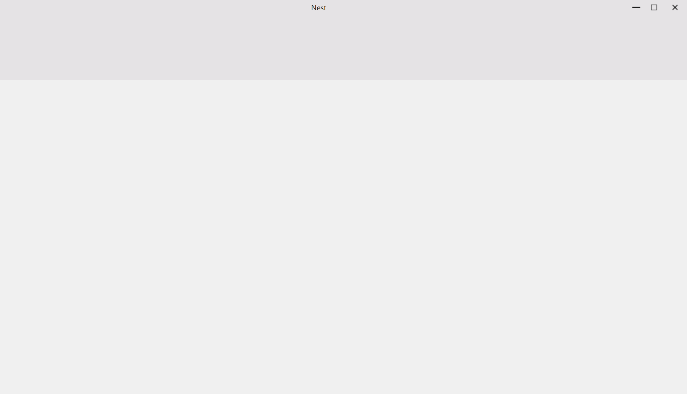

在本篇博客中，我将介绍**NestUI**模块的设计与实现，并说明如何集成第三方UI库SARibbon，如何设计`MainWindow`、`DockWidget`、`DockWidgetManager`等类

**项目仓库**：

::github{repo="Jerryym/Nest"}

---

## NestUI模块概述

### 模块职责

* 为Nest框架提供基于Qt的UI组件
* 负责对于框架中的UI进行管理，如：对于停靠窗口的管理(DockWidgetManager)

### 集成SARibbon

* **SARibbon**
  * 是一个Qt下的Ribbon界面控件，提供了类似微软Office系列软件的操作界面
  * SARibbon适用于大型软件、工业软件、复杂软件的ui
  * SARibbon在设计时参考了MFC Ribbon接口的命名风格
  * SARibbon的界面样式参考了微软Office系列软件以及WPS软件的Ribbon界面，并结合了两者的优点
  * SARibbon是一个可定义多种主题风格的Ribbon控件，它能通过qss快速的定义出自己想要的主题风格
* **集成SARibbon**
  
  在NestUI中，我将[SARibbon](https://github.com/czyt1988/SARibbon)库作为第三方构件来支撑框架中的UI。
  * 使用命令`git submodule add https://github.com/Jerryym/SARibbon.git NestUI/vendor/SARibbon`将SARibbon作为子模块添加到NestUI项目中，并通过命令`git submodule update --init --recursive`保证子模块被正确初始化和更新

### MainWindow

* **设计思路**、
  * 设计一个结构体用于存储主窗口属性：窗口宽度、窗口高度和窗口标题
  * 设计一个名为`MainWindow`的类，此类继承于`SARibbonMainWindow`，使其能够使用SARibbon风格的UI
  
    :::note
    后续根据开发和应用的实际需求，可能会把MainWindow设计成纯虚类。
    :::

* **代码**

  ```c++
  //MainWindow.h
  namespace NestUI {

      /// @brief 窗口属性
      typedef struct NESTUI_API sWindowProp
      {
          unsigned int m_nWidth;  //窗口宽
          unsigned int m_nHeight;  //窗口高
          QString m_STitle;   //窗口标题

          sWindowProp(unsigned int width = 1600, unsigned int height = 900,
            const QString& title = "Nest")
            : m_nWidth(width), m_nHeight(height), m_STitle(title)
          {}
      }sWindowProp;

      /// @brief 主窗口
      class NESTUI_API MainWindow : public SARibbonMainWindow
      {
          Q_OBJECT
      public:
          MainWindow(QWidget* parent = nullptr, const sWindowProp& sProp = sWindowProp());
          virtual ~MainWindow() {}

      public:
          /// @brief 获取主窗口宽度
          /// @return 
          unsigned int GetWidth() const { return m_sProp.m_nWidth; }
          /// @brief 获取主窗口高度
          /// @return 
          unsigned int GetHeigth() const { return m_sProp.m_nHeight; }
          /// @brief 获取主窗口标题名
          /// @return 
          QString GetTitle() const { return m_sProp.m_STitle; }

      private:
          /// @brief 主窗口属性
          sWindowProp m_sProp;
      };

  }

  //MainWindow.cpp
  namespace NestUI {

      MainWindow::MainWindow(QWidget* parent, const sWindowProp& sProp)
        : SARibbonMainWindow(parent), m_sProp(sProp)
      {
          //设置窗口标题
          setWindowTitle(sProp.m_STitle);
          //初始化窗口大小
          resize(QSize(sProp.m_nWidth, sProp.m_nHeight));
      }

  }
  ```

### DockWidget

* **设计思路**
  * 由于整个Nest框架是基于Qt开发的，所以主窗口类一定要能满足Qt相关特性（e.g：信号和槽机制）
  * 支持窗口设计，如设置窗口初始大小，窗口标题，窗口图标等
  * 支持可扩展，能够根据不同应用场景进行对应的继承扩展
* **实现**
  * 设计一个名为 `DockWidget`的类，此类继承于 `QDockWidget`，使其满足Qt停靠窗口相关功能和特性。
  * 设计一个名为 `clearWidget`方法，用于清空DockWidget内容。
  * 设计一个名为 `refreshWidget`方法，用于刷新DockWidget内容。
* **代码**

  ```c++
  //DockWidget.h
  namespace NestUI {

    class NESTUI_API DockWidget : public QDockWidget
    {
        Q_OBJECT
    public:
        DockWidget(QWidget* parent = nullptr);
        ~DockWidget();

    public:
        /// @brief 清空DockWidget内容
        virtual void clearWidget() = 0;
        /// @brief 刷新DockWidget
        virtual void refreshWidget() = 0;
    };

  }
  ```

### DockWidgetManager

在框架中，我希望有一个对象能管理应用程序主窗口中的所有停靠窗口，且能够提供相关增删改查的方法。

* **功能设计**
  * 这个类的对象在应用程序主窗口生命周期内当前仅存在一个，因此我们可以使用**单例模式**设计这个类。
  * 提供相关增删改查的方法。
* **实现**
  * 设计一个名为 `DockWidgetManager`的类，使用单例模式设计。
  * 在类中定义一个 `QMap`类型的成员变量，实现DockWidget对应的窗口标题与对应的DockWidget对象对应。
* **代码**

    ```c++
    //DockWidgetManager.h
    namespace NestUI {

        /// @brief DockWidget窗口管理类
        class NESTUI_API DockWidgetManager
        {
        public:
            /// @brief 获取当前DockManager
            /// @return 
            static DockWidgetManager* GetDockManager(QMainWindow* mainWindow);

            /// @brief 添加DockWidget
            /// @param STitle DockWidget对应的窗口标题
            /// @param dockWidget 
            void AddDockWidget(const QString& STitle, QDockWidget* dockWidget, Qt::DockWidgetArea area);

            /// @brief 获取DockWidget
            /// @param STitle STitle DockWidget对应的窗口标题
            /// @return 
            QDockWidget* GetDockWidget(const QString& STitle);

            /// @brief 移除DockWidget
            /// @param STitle DockWidget对应的窗口标题
            void RemoveDockWidget(const QString& STitle);

            /// @brief 获取当前主窗口中的dockWidget个数
            /// @return 
            int GetDockWidgetNum() const { return m_DockWidgetMap.size(); }

        protected:
            DockWidgetManager(QMainWindow* mainWindow);
            ~DockWidgetManager();

        private:
            /// @brief DockWidget窗口管理单例: 程序运行时，每个主窗口当且只能有一个DockManager存在
            static DockWidgetManager* s_Instance;
            QMainWindow* m_mainWindow; //应用程序主窗口
            //dockWidget Map
            QMap<QString, QDockWidget*> m_DockWidgetMap;
        };

    }

    //DockWidgetManager.cpp
    namespace NestUI {

        DockWidgetManager* DockWidgetManager::s_Instance = nullptr;

        DockWidgetManager::DockWidgetManager(QMainWindow* mainWindow)
        {
            m_mainWindow = mainWindow;
        }

        DockWidgetManager::~DockWidgetManager()
        {
            m_mainWindow = nullptr;
        }

        DockWidgetManager* DockWidgetManager::GetDockManager(QMainWindow* mainWindow)
        {
            // FIXED: 在此处插入 return 语句
            s_Instance = new DockWidgetManager(mainWindow);
            return s_Instance;
        }

        void DockWidgetManager::AddDockWidget(const QString& STitle, QDockWidget* dockWidget, Qt::DockWidgetArea area)
        {
            m_DockWidgetMap.insert(STitle, dockWidget);
            m_mainWindow->addDockWidget(area, dockWidget);
        }

        QDockWidget* DockWidgetManager::GetDockWidget(const QString& STitle)
        {
            if (m_DockWidgetMap.contains(STitle) == true)
            {
                return m_DockWidgetMap[STitle];
            }
            return nullptr;
        }

        void DockWidgetManager::RemoveDockWidget(const QString& STitle)
        {
            if (m_DockWidgetMap.contains(STitle) == true)
            {
                m_mainWindow->removeDockWidget(m_DockWidgetMap[STitle]);
                m_DockWidgetMap.remove(STitle);
            }
        }
    }
    ```

---

## 测试

为了检测当前程序设计的可用性，在Example项目中，修改了main.cpp文件中的代码：

```c++
int main(int argc, char* argv[])
{
    NestApp::Application app(argc, argv);

    NestUI::MainWindow* pMainWindow = new NestUI::MainWindow;
    app.SetMainWindow(pMainWindow);
    app.Run();

    return app.exec();
}
```

* **运行效果**
  
  从图上可以看到，最简单的MainWindow成功显示，大功告成~

---

## Reference

1. [SARibbon](https://github.com/czyt1988/SARibbon)
