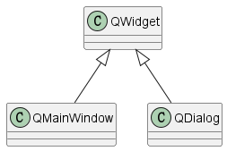

完成 `Applicaiton`类的初步设计和Log模块的设计后，我们将在本篇中对框架中的UI库中的 **主窗口（MainWindow）** 进行设计。

## 设计思路

在Qt中，有三种用户界面类：`QWidget`、`QMainWindow`、`QDialog`，其中 `QWidget`是 `QMainWindow`和 `QDialog`的基类。



- **QWidget**
  QWidget是所有用户界面对象的基类，它从窗口系统中接收鼠标、键盘和其他事件，并在屏幕上绘制自己。
- **QMainWindow**

  - QMainWindow是Qt框架自带的一个预定义好的主窗口类。所谓主窗口，即一个应用程序最顶层的窗口，比如VSCode就是一个主窗口。经典的主窗口通常是由一个标题栏，一个菜单栏，若干工具栏和一个任务栏组成。
  - Qt中QMainWindow的布局包括：QMenuBar(菜单栏)、QToolBar(工具栏)、QStatusBar(状态栏)、QDockWidget(停靠窗体)和Central Widget(中心小部件)，其中**Central Widget必须存在**。
    
- **QDialog**
  QDialog类是对话框窗口的基类。对话框窗口是主要用于短期任务以及和用户进行简要通讯的顶级窗口。QDialog可以是模式的也可以是非模式的。QDialog支持扩展性并且可以提供返回值。
- **功能设计**
  作为框架UI库中的MainWindow，我们希望其具有以下功能和特性：

  - 由于整个Nest框架是基于Qt开发的，所以主窗口类一定要能满足Qt相关特性（e.g：信号和槽机制）
  - 支持窗口设计，即设置窗口初始大小，窗口标题，窗口图标等。
  - 支持可扩展，能够根据不同应用场景进行对应的继承扩展。
- **实现**

  - 设计一个结构体用于存储主窗口属性：窗口宽度、窗口高度、窗口标题。
  - 设计一个名为 `MainWindow`的类，此类继承于 `QMainWindow`，使其满足Qt主窗口相关功能和特性。
  - 将 `MainWindow`设计为纯虚类，实现在使用框架进行应用开发时，实现符合应用场景的主窗口。

    - MainWindow.h

    ```cpp
    /// @brief 窗口属性
    typedef struct NESTUI_API sWindowProps
    {
        unsigned int m_nWidth;      //窗口宽
        unsigned int m_nHeight;     //窗口高
        QString m_STitle;           //窗口标题

        sWindowProps(unsigned int width = 1600, unsigned int height = 900,
            const QString& title = "Nest FrameWork")
            : m_nWidth(width), m_nHeight(height), m_STitle(title)
        {

        }
    }sWindowProps;

    /// @brief 主窗口
    class NESTUI_API MainWindow : public QMainWindow
    {
        Q_OBJECT
    public:
        virtual ~MainWindow() {}

    public:
        /// @brief 获取主窗口宽度
        /// @return 
        virtual unsigned int GetWidth() const = 0;
        /// @brief 获取主窗口高度
        /// @return 
        virtual unsigned int GetHeigth() const = 0;
        /// @brief 获取主窗口标题名
        /// @return 
        virtual QString GetTitle() const = 0;
    };
    ```

---

### Reference

[1] [Qt6入门教程 9：QWidget、QMainWindow和QDialog](https://blog.csdn.net/caoshangpa/article/details/135737372?spm=1001.2101.3001.6650.2&utm_medium=distribute.pc_relevant.none-task-blog-2%7Edefault%7EYuanLiJiHua%7EPosition-2-135737372-blog-108968738.235%5Ev43%5Epc_blog_bottom_relevance_base6&depth_1-utm_source=distribute.pc_relevant.none-task-blog-2%7Edefault%7EYuanLiJiHua%7EPosition-2-135737372-blog-108968738.235%5Ev43%5Epc_blog_bottom_relevance_base6&utm_relevant_index=5)
[2] [Qt6.5 官方文档](https://doc.qt.io/qt-6.5/)
