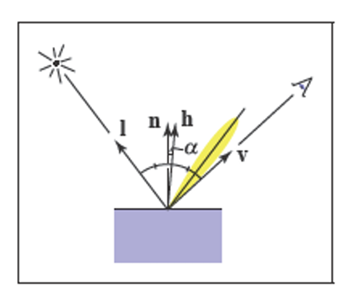
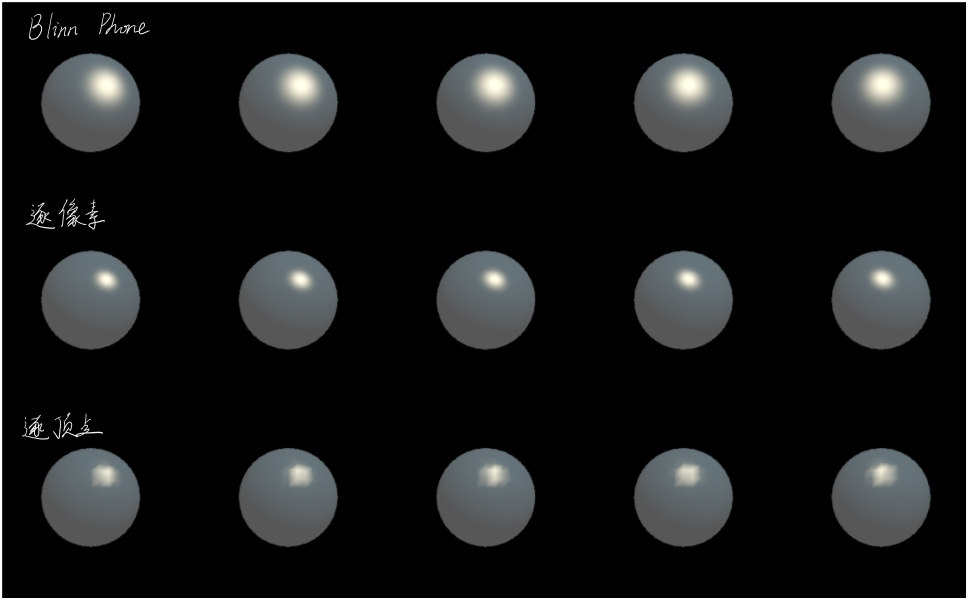

## BlinnPhone模型



在Phone模型中，需要计算反射方向向量来计算高光反射。因此在BlinnPhone模型中，定义了一个**半程向量（Halfway Vector）**，即光线方向向量和视角方向向量夹角的一半的单位向量，来**避免计算反射方向向量**，其公式如下：

$$
\vec{h} = \frac{\vec{l} + \vec{v}}{|\vec{l} + \vec{v}|}
$$

BlinnPhone模型的高光反射模的公式如下:

$$
c_{specular} = (c_{light}\cdot{m_{specular}})max(0, \vec{n}\cdot{\vec{h}})^{m_{gloss}}
$$

从公式中可以看出需要五个参数：

* 入射光线颜色和强度：$c_{light}$
* 高光反射系数：$m_{specular}$
* 表面法向量：$\vec{n}$
* 半程向量：$\vec{h}$，可通过半程向量公式计算获得
* 光泽度：$m_{gloss}$，用于控制高光反射区域的大小

### BlinnPhone光照

**原理**：整体同逐像素光照的高光反射的着色器，仅在计算高光反射时使用BlinnPhone的高光反射公式

```hlsl
Shader "Custom/BlinnPhone"
{
    Properties
    {
        _Diffuse ("漫反射颜色", Color) = (1, 1, 1, 1)
        _Specular ("高光反射颜色", Color) = (1, 1, 1, 1)
        _Gloss ("光泽度", Range(8.0, 256)) = 20
    }

    SubShader
    {
        Pass
        {
            Tags {"LightMode" = "ForwardBase"}

            CGPROGRAM

            #pragma vertex vert
            #pragma fragment frag

            #include "Lighting.cginc"

            fixed4 _Diffuse;
            fixed4 _Specular;
            float _Gloss;

            struct a2v
            {
                float4 vertex : POSITION;
                float3 normal : NORMAL;
            };

            struct v2f
            {
                float4 pos : SV_POSITION; 
                float3 worldNormal : TEXCOORD0;
                fixed3 worldPos : TEXCOORD1;
            };

            v2f vert(a2v v)
            {
                v2f o;
                //将顶点从模型空间坐标转成投影空间坐标
                o.pos = UnityObjectToClipPos(v.vertex);
                o.worldNormal = mul(v.normal, (float3x3)unity_WorldToObject);
                o.worldPos = mul(unity_ObjectToWorld, v.vertex).xyz;
            
                return o;
            }

            fixed4 frag(v2f i) : SV_Target
            {
                //获取环境光的颜色和强度
                fixed3 ambient = UNITY_LIGHTMODEL_AMBIENT.xyz;

                //获取世界坐标系下的法向量
                fixed3 worldNormal = normalize(i.worldNormal);
                //获取光源方向
                fixed3 worldLightDir = normalize(_WorldSpaceLightPos0.xyz);
                //计算漫反射强度
                fixed3 diffuse = _LightColor0.rgb * _Diffuse.rgb * saturate(dot(worldNormal, worldLightDir));

                //获取视角方向
                fixed3 viewDir = normalize(_WorldSpaceCameraPos.xyz - i.worldPos.xyz);
                //获取反射方向
                fixed3 halfDir = normalize(worldLightDir + viewDir);
                //计算高光反射(BlinnPhone模型)
                fixed3 specular = _LightColor0.rgb * _Specular.rgb * pow(max(0, dot(worldNormal, halfDir)), _Gloss);

                fixed3 color = ambient + diffuse + specular;
                return fixed4(color, 1.0);
            }

            ENDCG
        }
    }
    FallBack "Specular"
}
```



从图上可以看出，BlinnPhone模型高光反射效果和逐像素光照的效果类似，都比逐顶点光照效果平滑，不过BlinnPhone模型高光反射区域相比逐像素光照区域要更大一些，更亮一些。

---

## Reference

* 《UnityShader入门精要》
* 《Fundamentals of Computer Graphics》
* [图形学基础-Phong和Blinn-Phong光照模型](https://molers.github.io/2021/06/30/%E5%9B%BE%E5%BD%A2%E5%AD%A6%E5%9F%BA%E7%A1%80-Phong%E5%92%8CBlinn-Phong%E5%85%89%E7%85%A7%E6%A8%A1%E5%9E%8B/)
