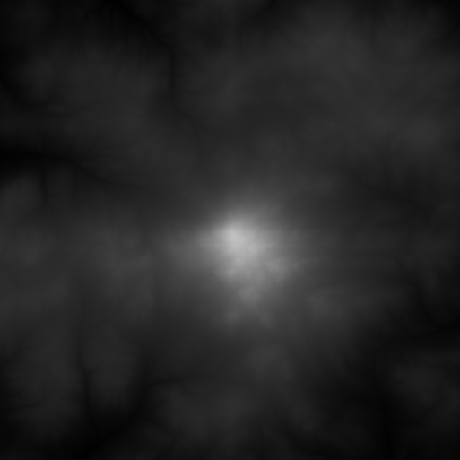
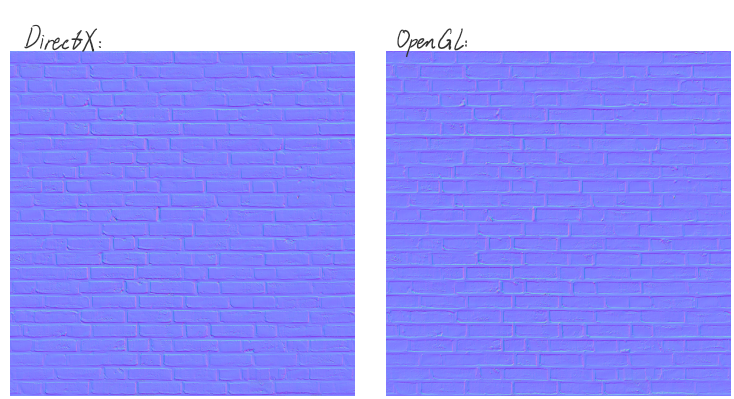
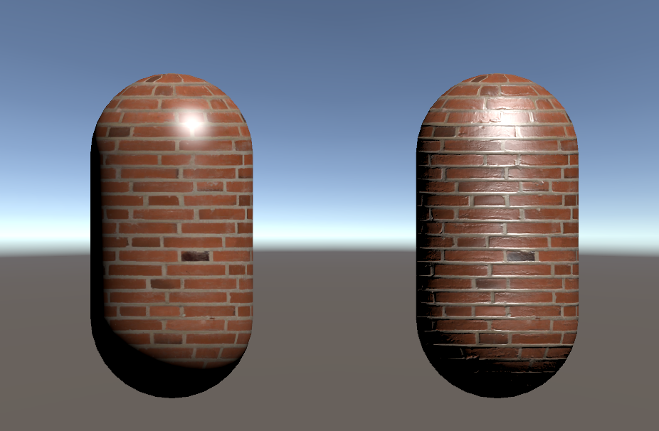

在真实世界中，物体表面的细节（如砖块的裂纹、皮肤的毛孔、金属的划痕）会影响光的反射方向，从而形成复杂的明暗变化。然而，在3D图形中，若完全依靠几何模型去刻画这些细节，不仅工作量巨大，还会严重影响渲染性能。

**凹凸贴图(Bump Mapping)** 是一种通过 **修改表面法线方向** 来模拟这些细节的技术。它不改变模型的顶点位置，而是在光照计算中“欺骗”眼睛，让表面看起来更加复杂、立体、真实。

## 实现凹凸贴图的方法

实现凹凸贴图的方法主要有两种：一种是使用一张高度纹理贴图来模拟表面唯一，然后计算得出一个修改后的法线向量；另一种是使用一张法线纹理贴图来直接存储表面法线。

### 高度贴图

* 高度贴图使用像素颜色来表示表面高度
* 高度贴图图像通常为**灰度图**
* 一般会使用Terragen等软件生成高度贴图
* **优点：** 直观，通过图像可以直接知道模型表面的凹凸情况
* **缺点：** 计算复杂，不能直接获取模型表面法线，而是需要根据高度贴图像素中的**灰度值**计算得出



### 法线贴图

法线贴图，顾名思义就是直接将模型表面的法相方向存储在图像中。

* **法线映射**
  由于法线方向的分量范围在[-1, 1]，而像素的分量范围在[0, 1]，所以需要将法线进行一次映射。其映射公式为：

$$
pixel = (normal + 1) / 2
$$

同时，基于此公式也可以反向推导出映射公式的逆函数，用于计算法线：

$$
normal = 2 * pixel - 1
$$

* **存储法线的方法**
  * **在切线空间中存储法线**
    * 每个像素的法线向量基于**切线空间**
    * 优点：
      * 自由度高，具有通用性
      * 可进行UV动画
      * 可重用
      * 可压缩
  * **在模型空间中存储法线**
    * 每个像素的法线向量基于**模型空间**
    * 优点：
      * 实现简单
      * 在纹理坐标的缝合处和尖锐的边角部分，可以提供平滑的边界
    * 缺点：由于模型空间下的法线贴图记录的是**绝对法线信息**，所以这类法线贴图仅适用于创建贴图时的模型，不具有通用性

> 📌**Note: DirectX和OpenGL下的法线贴图差异**
>
> * DirectX使用**左手坐标系**，Y轴向上；OpenGL使用**右手坐标系**，Y轴向下。因此两者的法线贴图的凹凸情况是相反的
> * Unity默认使用**左手坐标系**，即DirectX风格
>
> 

---

## 凹凸贴图着色器实现

### 属性

```hlsl
_Color ("颜色", Color) = (1, 1, 1, 1)
_MainTex ("主纹理", 2D) = "white" {}
_BumpMap ("法线纹理", 2D) = "bump" {}//bump-Unity内置的法线纹理
_BumpScale ("凹凸比例", Range(0, 1)) = 1
_Specular ("高光反射颜色", Color) = (1, 1, 1, 1)
_Gloss ("光泽度", Range(8.0, 256)) = 20
```

在着色器中定义纹理属性：颜色、主纹理、法线纹理、凹凸比例、高光反射颜色、光泽度。其中：

* 颜色：用于描述物体自身颜色
* 主纹理：用于描述物体的漫反射颜色的纹理图片，默认是一个纯白的纹理 **（注：white是Unity内置的纯白纹理）**
* 法线纹理：用于描述物体的法线纹理图片，默认是Unity内置的法线纹理 **（注：bump是Unity内置的法线纹理）**
* 凹凸比例：用于控制法线纹理在计算光照时的凹凸比例
* 高光反射颜色：用于描述物体的高光反射颜色
* 光泽度：用于描述物体的光泽度

### 着色器变量

```hlsl
fixed4 _Color;
sampler2D _MainTex;//主纹理
float4 _MainTex_ST;//主纹理属性
sampler2D _BumpMap;//法线纹理
float4 _BumpMap_ST;//法线纹理属性
float _BumpScale;//凹凸比例
fixed4 _Specular;
float _Gloss;
```

定义与属性相匹配的着色器变量。设计思路如下：

* 使用 `sampler2D` 表示纹理资源
  * `sampler2D`：2D纹理采样器，用于访问主纹理图像的数据
  * 在着色器中，使用函数 `tex2D(_MainTex, uv)`实现对于纹理的采样，获得对应uv坐标下的颜色等数据
* 使用 `float4 _MainTex_ST` 表示纹理属性
  * `_MainTex_ST.xy`：存储纹理的缩放值(Tiling)，用于控制纹理在物体表面上重复的次数
  * `_MainTex_ST.zw`：存储纹理的平移值(Offset)，控制纹理在表面上的起始位置（即纹理的uv坐标在纹理坐标系中的偏移值）
  * 在UnityCG.cginc中定义了 `TRANSFORM_TEX` 宏，用于将纹理的uv坐标进行缩放和平移，并返回结果
* 使用 `float4 _BumpMap_ST` 表示法线纹理属性
  * `_BumpMap_ST.xy`：存储法线纹理的缩放值(Tiling)，用于控制法线纹理在物体表面上重复的次数
  * `_BumpMap_ST.zw`：存储法线纹理的平移值(Offset)，控制法线纹理在表面上的起始位置（即纹理的uv坐标在纹理坐标系中的偏移值）

### 在切线空间中进行光照计算

```hlsl

Shader "Custom/NormalMapTangentSpace"
{
    Properties
    {
        _Color ("颜色", Color) = (1, 1, 1, 1)
        _MainTex ("主纹理", 2D) = "white" {}
        _BumpMap ("法线纹理", 2D) = "bump" {}//bump-Unity内置的法线纹理
        _BumpScale ("凹凸比例", Range(0, 1)) = 1
        _Specular ("高光反射颜色", Color) = (1, 1, 1, 1)
        _Gloss ("光泽度", Range(8.0, 256)) = 20
    }

    SubShader
    {
        Pass
        {
            Tags { "LightMode" = "ForwardBase" }

            CGPROGRAM

            #pragma vertex vert
            #pragma fragment frag

            #include "Lighting.cginc"

            fixed4 _Color;
            sampler2D _MainTex;//主纹理
            float4 _MainTex_ST;//主纹理属性
            sampler2D _BumpMap;//法线纹理
            float4 _BumpMap_ST;//法线纹理属性
            float _BumpScale;//凹凸比例
            fixed4 _Specular;
            float _Gloss;

            struct a2v
            {
                float4 vertex :POSITION;
                float3 normal : NORMAL;
                float4 tangent : TANGENT;
                float4 texcoord : TEXCOORD0;
            };

            struct v2f
            {
                float4 pos : SV_POSITION;
                float4 uv : TEXCOORD0;
                float3 lightDir : TEXCOORD1;
                float3 viewDir : TEXCOORD2;
            };

            v2f vert(a2v v)
            {
                v2f o;
                o.pos = UnityObjectToClipPos(v.vertex);
                o.uv.xy = v.texcoord.xy * _MainTex_ST.xy + _MainTex_ST.zw;
                o.uv.zw = v.texcoord.xy * _BumpMap_ST.xy + _BumpMap_ST.zw;

                //计算副法线
                TANGENT_SPACE_ROTATION;

                //计算光照方向
                o.lightDir = mul(rotation, ObjSpaceLightDir(v.vertex)).xyz;
                //计算视角方向
                o.viewDir = mul(rotation, ObjSpaceViewDir(v.vertex)).xyz;

                return o;
            }

            fixed4 frag(v2f i) : SV_Target
            {
                fixed3 tangentLightDir = normalize(i.lightDir);
                fixed3 tangentViewDir = normalize(i.viewDir);

                fixed4 packedNormal = tex2D(_BumpMap, i.uv.zw);
                fixed3 tangentNormal = UnpackNormal(packedNormal);
                tangentNormal.xy *= _BumpScale;
                tangentNormal.z = sqrt(1.0 - saturate(dot(tangentNormal.xy, tangentNormal.xy)));

                fixed3 albedo = tex2D(_MainTex, i.uv.xy).rgb * _Color.rgb;

                fixed3 ambient = UNITY_LIGHTMODEL_AMBIENT.rgb * albedo;

                fixed3 diffuse = _LightColor0.rgb * albedo * saturate(dot(tangentNormal, tangentLightDir));

                fixed3 halfDir = normalize(tangentLightDir + tangentViewDir);
                fixed3 specular = _LightColor0.rgb * _Specular.rgb * pow(saturate(dot(tangentNormal, halfDir)), _Gloss);

                return fixed4(ambient + diffuse + specular, 1.0);
            }

            ENDCG
        }
    }
    FallBack "Specular"
}
```

### 效果



左侧为基础贴图，右侧为凹凸贴图，可以看出加上法线贴图后，物体的凹凸效果会更明显。

---

## Reference

* 《UnityShader入门精要》
* [快速判断OpenGL和DirectX法线的技巧 - 鱼香芥末的文章 - 知乎](https://zhuanlan.zhihu.com/p/341708714)
