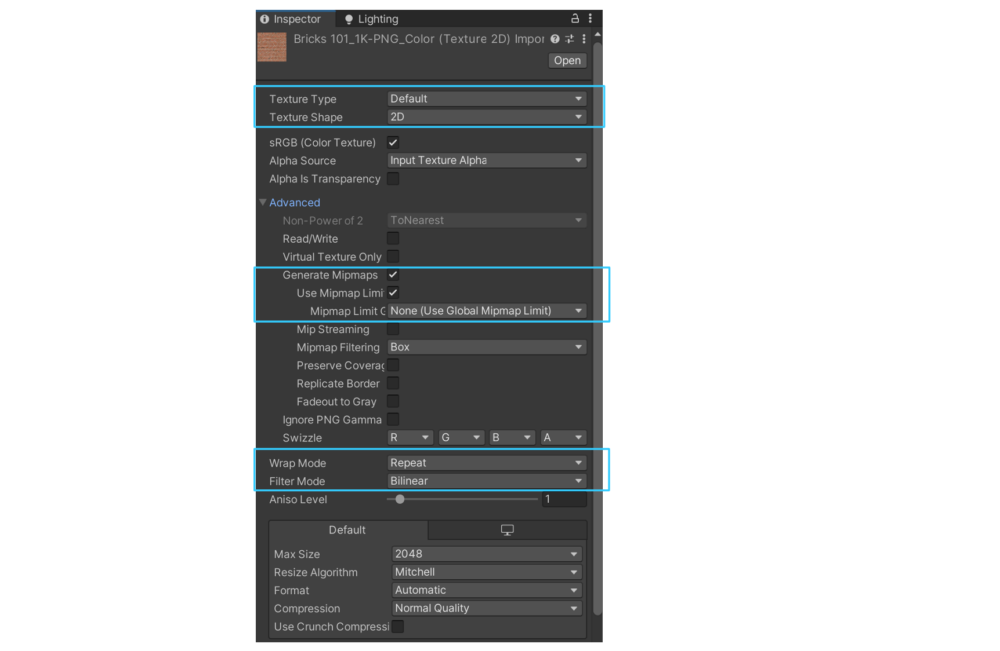

在实际项目中，一般会使用图片来描述物体的漫反射颜色、粗糙度、金属度等信息，而这类图片我们一般称之为纹理(Texture)。

## 基础纹理贴图

### 纹理属性

```hlsl
_Color ("颜色", Color) = (1, 1, 1, 1)
_MainTex ("主纹理", 2D) = "white" {}
_Specular ("高光反射颜色", Color) = (1, 1, 1, 1)
_Gloss ("光泽度", Range(8.0, 256)) = 20
```

首先，在着色器中定义一些纹理属性：颜色、主纹理、高光反射颜色、光泽度。其中：

* 颜色：用于描述物体自身颜色
* 主纹理：用于描述物体的漫反射颜色的纹理图片，默认是一个纯白的纹理 **（注：white是Unity内置的纯白纹理）**
* 高光反射颜色：用于描述物体的高光反射颜色
* 光泽度：用于描述物体的光泽度

### 着色器变量

```hlsl
fixed4 _Color;
sampler2D _MainTex;//纹理
float4 _MainTex_ST;//纹理属性
fixed4 _Specular;
float _Gloss;
```

然后，定义与属性相匹配的着色器变量。设计思路如下：

* 使用 `sampler2D` 表示纹理资源
  * `sampler2D`：2D纹理采样器，用于访问主纹理图像的数据
  * 在着色器中，使用函数 `tex2D(_MainTex, uv)`实现对于纹理的采样，获得对应uv坐标下的颜色等数据
* 使用 `float4 _MainTex_ST` 表示纹理属性
  * `_MainTex_ST.xy`：存储纹理的缩放值(Tiling)，用于控制纹理在物体表面上重复的次数
  * `_MainTex_ST.zw`：存储纹理的平移值(Offset)，控制纹理在表面上的起始位置（即纹理的uv坐标在纹理坐标系中的偏移值）
  * 在UnityCG.cginc中定义了 `TRANSFORM_TEX` 宏，用于将纹理的uv坐标进行缩放和平移，并返回结果

### Unity纹理设置



在Unity中，对于纹理的属性来说，当前只需关注三个方面：

* 纹理类型(Texture Type)
  * 指定该纹理的用途，Unity会根据类型应用不同的处理方式
  * 类型：
    * Default：普通纹理，适用于颜色贴图、金属贴图等
    * Normal map：法线贴图，会被转换为切线空间的法线信息
    * Sprite (2D and UI)：用于UI或2D游戏
* 环绕模式(Wrap Mode)
  * 控制当纹理坐标（uv）超出[0, 1]范围时的行为
  * 类型：
    * Repeat：纹理会平铺重复
    * Clamp：超出范围的坐标将使用纹理边缘颜色
    * Mirror：以镜像方式平铺纹理
* 过滤模式(Filter Mode)
  * 定义纹理由于变换而产生拉伸时会采用那种插值方法
  * 类型：
    * Point：点采样，不做插值，像素风格清晰（适合像素游戏）
    * Bilinear：双线性插值，平滑但可能略模糊
    * Trilinear：三线性插值，结合 mipmap，提升远距离效果
  * 三种插值方法的过滤效果依次提升，但所需的性能消耗也依次增大
* 多级纹理(Mipmap)
  * 使用多级纹理，Unity会自动生成一系列逐渐缩小的纹理版本
  * 优点：提升远距离渲染性能，减少锯齿感等问题

### 基础纹理贴图着色器

```hlsl
Shader "Custom/SingleTexture"
{
    Properties
    {
        _Color ("颜色", Color) = (1, 1, 1, 1)
        _MainTex ("主纹理", 2D) = "white" {}
        _Specular ("高光反射颜色", Color) = (1, 1, 1, 1)
        _Gloss ("光泽度", Range(8.0, 256)) = 20
    }

    SubShader
    {
        Pass
        {
            Tags { "LightMode" = "ForwardBase" }

            CGPROGRAM

            #pragma vertex vert
            #pragma fragment frag

            #include "Lighting.cginc"

            fixed4 _Color;
            sampler2D _MainTex;//纹理
            float4 _MainTex_ST;//纹理属性
            fixed4 _Specular;
            float _Gloss;

            struct a2v
            {
                float4 vertex :POSITION;
                float3 normal : NORMAL;
                float4 texcoord : TEXCOORD0;
            };

            struct v2f
            {
                float4 pos : SV_POSITION;
                float3 worldNormal : TEXCOORD0;
                float3 worldPos : TEXCOORD1;
                float2 uv : TEXCOORD2;
            };

            v2f vert(a2v v)
            {
                v2f o;
                o.pos = UnityObjectToClipPos(v.vertex);
                o.worldNormal = UnityObjectToWorldNormal(v.normal);
                o.worldPos = mul(unity_ObjectToWorld, v.vertex).xyz;
                o.uv = v.texcoord.xy * _MainTex_ST.xy + _MainTex_ST.zw;
                return o;
            }

            fixed4 frag(v2f i) : SV_Target
            {
                //计算材质反射率
                fixed3 albedo = tex2D(_MainTex, i.uv).rgb * _Color.rgb;

                //获取环境光的颜色和强度
                fixed3 ambient = UNITY_LIGHTMODEL_AMBIENT.xyz;

                //获取世界坐标系下的法向量
                fixed3 worldNormal = normalize(i.worldNormal);
                //获取光源方向
                fixed3 worldLightDir = normalize(UnityWorldSpaceLightDir(i.worldPos));
                //计算漫反射强度
                fixed3 diffuse = _LightColor0.rgb * albedo * max(0, dot(worldNormal, worldLightDir));

                //获取视角方向
                fixed3 viewDir = normalize(UnityWorldSpaceViewDir(i.worldPos));
                //获取反射方向
                fixed3 halfDir = normalize(worldLightDir + viewDir);
                //计算高光反射(BlinnPhone模型)
                fixed3 specular = _LightColor0.rgb * _Specular.rgb * pow(max(0, dot(worldNormal, halfDir)), _Gloss);

                fixed3 color = ambient + diffuse + specular;
                return fixed4(color, 1.0);
            }
            ENDCG
        }
    }
    FallBack "Specular"
}
```

---

## 纹理和材质的区别

| 纹理                                         | 材质                                                                         |
| -------------------------------------------- | ---------------------------------------------------------------------------- |
| 一张图像资源（如：1D、2D、3D、立方体贴图等） | 在渲染引擎中用于描述模型表面物理属性的数据集合（如：反射、粗糙度、金属度等） |
| 用于提供颜色、法线、粗糙度等属性数据         | 在渲染中决定物体如何与光交互，定义其外观和表现方式                           |
| 材质的组成部分，用作其属性输入               | 一个材质可以包含多个纹理，每种纹理控制材质中的某个特定属性                   |

---

## Reference

* 《UnityShader入门精要》
* [Learn OpenGL - 纹理](https://learnopengl-cn.github.io/01%20Getting%20started/06%20Textures/)
