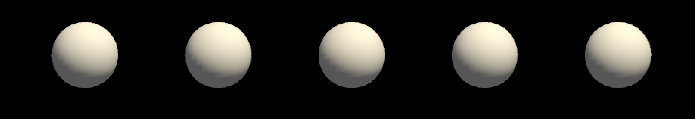
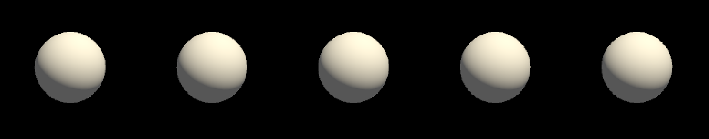
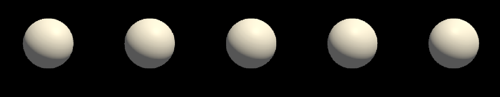
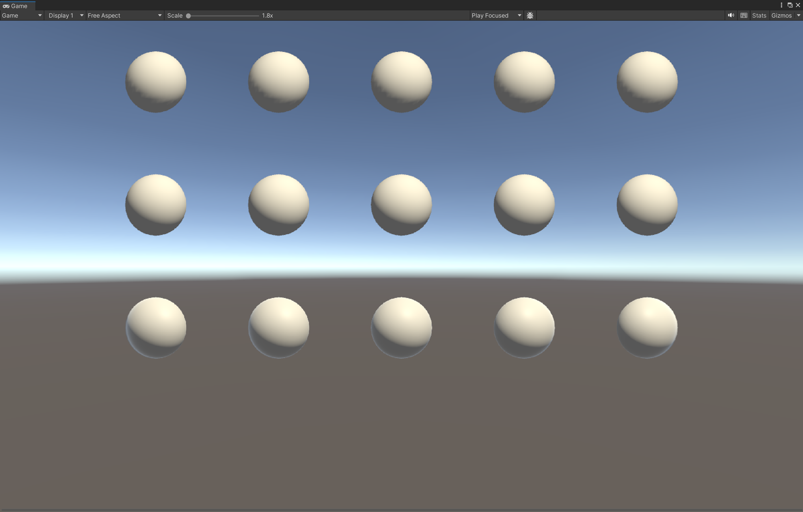

## 标准光照模型

标准光照模型（又称为Phone光照模型）只关心直接光照，即那些**直接从光源发射**出来照射到物体表面后，**经过物体表面的一次反射直接进入相机的光线**，即仅考虑**光源→物体表面→摄像机**的直接光路，忽略光线在环境中的多次反射。
进入到相机内的光线可以分为四个部分：

* **环境光(ambient)**
  * 环境光用来近似模拟**间接光照**（即在多个物体之间反射后，进入摄像机的光线）
  * 环境光通常为一个全局变量，即场景中所有物体都使用这个环境光
  * 在Unity Shader中，使用内置变量 `UNITY_LIGHTMODEL_AMBIENT`能够获取到环境光的**颜色**
  * **计算公式**：$c_{ambient}=g_{ambient}$
* **自发光(emissive)**：物体自身发光，不受其他光照影响
* **漫反射(diffuse)**
  * 光线从光源照射到模型表面时，模型表面向每个方向散射的辐射量
  * 漫反射光照遵循**兰伯特定律**：反射光线的强度与表面法线(n)和光源方向(l)之间的夹角的**余弦值成正比**
  * **计算公式**：$c_{diffuse}=(c_{light}\cdot{m_{diffuse}})\max(0, \vec{n}\cdot{\vec{l}})$
* **高光反射(specular)**：模拟光线在光滑表面的镜面反射（如金属、玻璃），光线仅在特定方向（反射方向）散射

综上，标准光照模型的**计算公式**为：

$$
c=c_{ambient} + c_{diffuse} + c_{specular}
$$

***Note:** 在标准光照模型中，自发光通常单独计算，不参与光照公式的叠加*

---

## 漫反射基础光照模型

### 数学模型

1. 兰伯特定律

   $$
   c_{diffuse}=(c_{light}\cdot{m_{diffuse}})\max(0, \vec{n}\cdot{\vec{l}})
   $$

   $c_{light}$：光源颜色
   $m_{diffuse}$：材质的漫反射颜色
   $\vec{n}$：模型表面法向量
   $\vec{l}$：指向光源的单位向量
2. 漫反射光照强度受法线与光线夹角影响

   * 法线正对光源（夹角 = 0°，点积 = 1）时，漫反射最强
   * 法线与光源垂直（夹角 = 90°，点积 = 0）时，漫反射为0
   * 法线背对光源（点积 < 0）时，直接裁剪为0（背光区域全黑）

### 逐顶点光照

* **原理**：在**顶点着色器**中计算光照，结果通过插值传递到片元，适合低计算成本场景

```hlsl
Shader "Custom/DiffuseVertexLevel"
{
    Properties
    {
        //材质的漫反射颜色
        _Diffuse ("Diffuse Color", Color) = (1, 1, 1, 1)
    }

    SubShader
    {
        Pass
        {
            //基础光照通道: 前向渲染
            Tags {"LightMode" = "ForwardBase"}

            CGPROGRAM

            #pragma vertex vert
            #pragma fragment frag

            #include "Lighting.cginc"

            //材质的漫反射颜色
            fixed4 _Diffuse;

            struct a2v
            {
                float4 vertex : POSITION;
                float3 normal : NORMAL;
            };

            struct v2f
            {
                float4 pos : SV_POSITION;
                float3 color : COLOR;
            };

            v2f vert(a2v v)
            {
                v2f o;
                //将顶点从模型空间坐标转成裁剪空间坐标
                o.pos = UnityObjectToClipPos(v.vertex);

                //获取环境光的颜色和强度
                fixed3 ambient = UNITY_LIGHTMODEL_AMBIENT.xyz;

                //将法向量从世界空间坐标转成模型空间坐标
                fixed3 worldNormal = normalize(mul(v.normal, (float3x3)unity_WorldToObject));
                //获取光源方向
                fixed3 worldLightDir = normalize(_WorldSpaceLightPos0.xyz);
                //计算漫反射强度 = max(dot(N, L), 0)
                fixed3 diffuse = _LightColor0.rgb * _Diffuse.rgb * saturate(dot(worldNormal, worldLightDir));

                //颜色 = 环境光 + 漫反射
                o.color = ambient + diffuse;

                return o;
            }

            fixed4 frag(v2f i) : SV_Target
            {
                return fixed4(i.color, 1.0);
            }

            ENDCG
        }
    }

    FallBack "Diffuse"
}
```



### 逐像素光照

* **原理**：在**片元着色器**中对每个像素独立计算光照（先获取像素的法线，再进行光照计算），避免顶点插值带来的精度损失。

```hlsl
Shader "Custom/DiffusePixelLevel"
{
    Properties
    {
        //材质的漫反射颜色
        _Diffuse ("Diffuse Color", Color) = (1, 1, 1, 1)
    }

    SubShader
    {
        Pass
        {
            //基础光照通道: 前向渲染
            Tags {"LightMode" = "ForwardBase"}

            CGPROGRAM

            #pragma vertex vert
            #pragma fragment frag

            #include "Lighting.cginc"

            //材质的漫反射颜色
            fixed4 _Diffuse;

            struct a2v
            {
                float4 vertex : POSITION;
                float3 normal : NORMAL;
            };

            struct v2f
            {
                float4 pos : SV_POSITION;
                float3 worldNormal : TEXCOORD0;
            };

            v2f vert(a2v v)
            {
                v2f o;

                //将顶点从模型空间坐标转成裁剪空间坐标
                o.pos = UnityObjectToClipPos(v.vertex);
                //最终颜色 = 环境光 + 漫反射
                o.worldNormal = mul(v.normal, (float3x3)unity_WorldToObject);

                return o;
            }

            fixed4 frag(v2f i) : SV_Target
            {
                //获取环境光的颜色和强度
                fixed3 ambient = UNITY_LIGHTMODEL_AMBIENT.xyz;

                //获取世界坐标系下的法向量
                fixed3 worldNormal = normalize(i.worldNormal);

                //获取光源方向
                fixed3 worldLightDir = normalize(_WorldSpaceLightPos0.xyz);

                //计算漫反射强度 = max(dot(N, L), 0)
                fixed3 diffuse = _LightColor0.rgb * _Diffuse.rgb * saturate(dot(worldNormal, worldLightDir));

                //颜色 = 环境光 + 漫反射
                fixed3 color = ambient + diffuse;

                return fixed4(color, 1.0);
            }

            ENDCG
        }
    }

    FallBack "Diffuse"
}

```



### Half Lambert光照

* **原理**：在标准兰伯特漫反射模型中，当表面背对光源时(即 $\vec{n}\cdot{\vec{l}}$ 点积小于0)，会直接将结果裁剪为0，导致背光区域突然变暗、缺乏自然过渡。为了解决黑影太硬、背光太黑的问题，提出了一种改进型的技术——**半兰伯特模型**，模型公式如下：

$$
c_{diffuse}=(c_{light}\cdot{m_{diffuse}})\max(\alpha(\vec{n}\cdot{\vec{l}})+\beta)
$$

1. 通过引入两个参数 $\alpha$ 和 $\beta$ 实现对于点积的裁剪，从而实现渐变过渡。
2. 通常情况下，会将 $\alpha$ 和 $\beta$ 都设置为 0.5，实现 $\vec{n}\cdot{\vec{l}}$ 的计算结果从[-1, 1]映射到[0, 1]。

```hlsl
Shader "Custom/HalfLambert"
{
    Properties
    {
        //材质的漫反射颜色
        _Diffuse ("Diffuse Color", Color) = (1, 1, 1, 1)
    }

    SubShader
    {
        Pass
        {
            //基础光照通道: 前向渲染
            Tags {"LightMode" = "ForwardBase"}

            CGPROGRAM

            #pragma vertex vert
            #pragma fragment frag
  
            #include "Lighting.cginc"

            //材质的漫反射颜色
            fixed4 _Diffuse;

            struct a2v
            {
                float4 vertex : POSITION;
                float3 normal : NORMAL;
            };

            struct v2f
            {
                float4 pos : SV_POSITION;
                float3 worldNormal : TEXCOORD0;
            };

            v2f vert(a2v v)
            {
                v2f o;
    
                //将顶点从模型空间坐标转成裁剪空间坐标
                o.pos = UnityObjectToClipPos(v.vertex);
                //最终颜色 = 环境光 + 漫反射
                o.worldNormal = mul(v.normal, (float3x3)unity_WorldToObject);
    
                return o;
            }

            fixed4 frag(v2f i) : SV_Target
            {
                //获取环境光的颜色和强度
                fixed3 ambient = UNITY_LIGHTMODEL_AMBIENT.xyz;

                //获取世界坐标系下的法向量
                fixed3 worldNormal = normalize(i.worldNormal);

                //获取光源方向
                fixed3 worldLightDir = normalize(_WorldSpaceLightPos0.xyz);

                //计算漫反射强度 = max(dot(N, L), 0)
                fixed halfLambert = dot(worldNormal, worldLightDir) * 0.5 + 0.5;
                fixed3 diffuse = _LightColor0.rgb * _Diffuse.rgb * halfLambert;

                //颜色 = 环境光 + 漫反射
                fixed3 color = ambient + diffuse;

                return fixed4(color, 1.0);
            }

            ENDCG
        }
    }

    FallBack "Diffuse"
}

```



### 对比总结



| 类型                       | 计算位置   | 优点                           | 缺点                             |
| -------------------------- | ---------- | ------------------------------ | -------------------------------- |
| **逐顶点光照**       | 顶点着色器 | 计算量极小，适合低端设备       | 光照过渡粗糙，低精度模型锯齿明显 |
| **逐像素光照**       | 片元着色器 | 光照平滑                       | 计算量较大                       |
| **Half-Lambert光照** | 片元着色器 | 能够避免全黑区域，增强暗部细节 |                                  |

---

## 常用的内置函数和变量

| 变量名                       | 类型         | 含义                                                          |
| ---------------------------- | ------------ | ------------------------------------------------------------- |
| `UnityObjectToClipPos`     | 函数         | 将**模型空间**坐标转换到**裁剪空间**坐标          |
| `unity_WorldToObject`      | `float4x4` | 将**世界空间**的坐标/向量变换到**模型空间**的矩阵 |
| `_LightColor0`             | `fixed4`   | 当前主光源颜色（RGB）和强度（A）                              |
| `_WorldSpaceLightPos0`     | `float4`   | 当前主光源的方向或位置                                        |
| `UNITY_LIGHTMODEL_AMBIENT` | `fixed4`   | 环境光颜色                                                    |

---

## Reference

* 《UnityShader入门精要》
