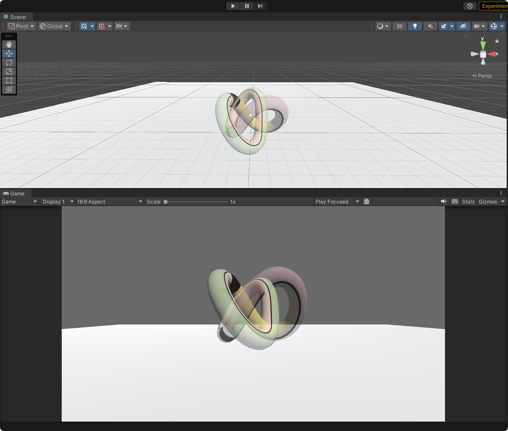
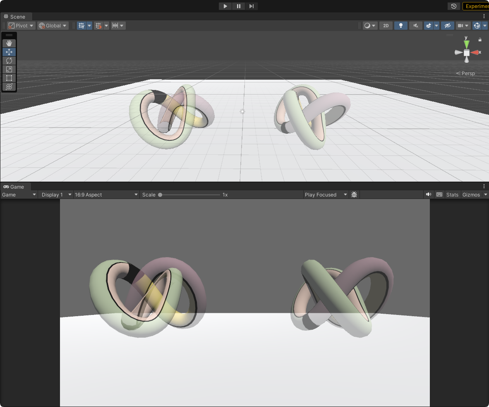

在上篇笔记中，我们通过透明度混合实现了半透明效果。在实现过程中，我们关闭了深度写入（ZWrite Off），以减少半透明物体的渲染顺序错误。

然而，当模型存在自相交，或多个半透明物体互相交叉时，这种做法会带来新的问题——由于半透明混合依赖于颜色缓冲中已有的像素颜色，而关闭深度写入会使 GPU 无法记录这些像素的深度信息，导致无法正确判断前后关系，从而出现如下图所示的错误效果：



为了解决这个问题，我们可以**开启深度写入**。这样在渲染半透明物体时，GPU 会将每个通过深度测试的片元深度信息写入深度缓冲，从而在后续的绘制中正确判断前后遮挡关系，避免因顺序错误造成的混合异常。

不过，直接开启深度写入又会引发另一个问题——由于先绘制的片元会提前写入**深度缓冲（Z-Buffer）**，后绘制的半透明片元即使应该可见，也可能会被深度测试裁掉，导致渲染缺失。

因此，我们通常将开启深度写入的半透明渲染拆分为两个Pass：

* **第一个Pass**：**开启深度写入** `ZWrite On`，但不输出颜色
* **第二个Pass**：开启正常的透明度混合（如 `Blend SrcAlpha OneMinusSrcAlpha`），**关闭深度写入** `ZWrite Off`

这样就能保证第二个Pass可以根据第一个Pass写入的深度信息进行透明度混合，最终实现半透明效果。

---

## 开启深度写入的半透明效果

### 属性

```hlsl
_Color ("Main Tint", Color) = (1, 1, 1, 1)
_MainTex ("主纹理", 2D) = "white" {}
_AlphaScale ("Alpha Scale", Range(0, 1)) = 1
```

在着色器中定义了纹理属性：颜色、主贴图、透明度缩放

* 颜色：用于描述物体自身颜色
* 主纹理：用于描述物体的漫反射颜色的纹理图片，默认是一个纯白的纹理
* **透明度缩放**：整体控制纹理像素的透明度

### SubShader语义中的标签（Tags）设置

```hlsl
Tags 
{
    "Queue"="Transparent"
    "IgnoreProjector"="True"
    "RenderType"="Transparent"
}
```

与透明度测试设置的标签不同，在透明度混合中，我们定义了3个标签：

* `"Queue" = "Transparent"`：放到透明队列中绘制（即在所有不透明物体之后渲染）
* `"IgnoreProjector" = "True"`：不受 Projector 投影影响
* `"RenderType" = "Transparent"`：标记当前Shader渲染出来的物体属于**透明物体类别**

### 定义两个Pass实现半透明渲染

#### 第一个 Pass：开启深度写入，关闭颜色输出

* 开启深度写入 `ZWrite On`，确保半透明物体的深度信息被正确写入深度缓冲。
* 使用 `ColorMask 0`关闭颜色缓冲的写入，确保不输出颜色。

```hlsl
Pass
{
    ZWrite On
    ColorMask 0
}
```

`ColorMask`是用来控制颜色通道的写掩码，常见语义包括：

* `RGB`: 写入红、绿、蓝通道
* `A`: 写入透明度通道
* `0`: 关闭所有颜色通道写入

在这里使用 `ColorMask 0`，确保**只写入深度信息，不写入颜色信息**。

#### 第二个Pass：关闭深度写入，开启透明度混合

* 关闭深度写入 `ZWrite Off`，避免混合时覆盖深度信息
* 开启透明度混合 `Blend SrcAlpha OneMinusSrcAlpha`，实现正确的半透明混合效果
* 其余渲染逻辑与普通透明度混合着色器相同

```hlsl
Pass
{
    Tags
    {
        "LightMode"="ForwardBase"
    }

    //关闭深度写入
    ZWrite Off
    //开启混合模式
    Blend SrcAlpha OneMinusSrcAlpha

    CGPROGRAM
    #pragma vertex vert
    #pragma fragment frag
    #include "Lighting.cginc"
  
    fixed4 _Color;
    sampler2D _MainTex;
    float4 _MainTex_ST;
    fixed _AlphaScale;

    struct a2v
    {
        float4 vertex : POSITION;
        float3 normal : NORMAL;
        float4 texcoord : TEXCOORD0;
    };

    struct v2f
    {
        float4 pos : SV_POSITION;
        float3 worldNormal : TEXCOORD0;
        float3 worldPos : TEXCOORD1;
        float2 uv : TEXCOORD2;
    };

     v2f vert(a2v v)
    {
        v2f o;
        //将顶点从模型空间坐标转成投影空间坐标
        o.pos = UnityObjectToClipPos(v.vertex);
        o.worldNormal = UnityObjectToWorldNormal(v.normal);
        o.worldPos = mul(unity_ObjectToWorld, v.vertex).xyz;
        o.uv = TRANSFORM_TEX(v.texcoord, _MainTex);

        return o;
    }

    fixed4 frag(v2f i) : SV_Target
    {
        fixed3 worldNormal = normalize(i.worldNormal);
        fixed3 worldLightDir = normalize(UnityWorldSpaceLightDir(i.worldPos));

        fixed4 texColor = tex2D(_MainTex, i.uv);
        fixed3 albedo = texColor.rgb * _Color.rgb;
        fixed3 ambient = UNITY_LIGHTMODEL_AMBIENT.xyz * albedo;
        fixed3 diffuse = _LightColor0.rgb * albedo * max(0, dot(worldNormal, worldLightDir));
        return fixed4(ambient + diffuse, texColor.a * _AlphaScale);
    }

    ENDCG
}
```

### 效果



从上图可以看到：

* **左侧（未开启深度写入）**：GPU 没有将半透明片元的深度信息写入深度缓冲，渲染顺序完全依赖绘制顺序而非真实的空间位置，导致前后关系出现错乱。
* **右侧（开启深度写入）**：在第一个Pass中，半透明片元的深度被正确写入深度缓冲，后续Pass在混合时能够依据这些深度信息进行正确的前后裁剪，从而得到正确的透明效果。

---

## Reference

* 《UnityShader入门精要》
* [图形学|shader|用一篇文章理解半透明渲染、透明度测试和混合、提前深度测试并彻底理清渲染顺序。 - aganztracy的文章 - 知乎](https://zhuanlan.zhihu.com/p/263566318)
