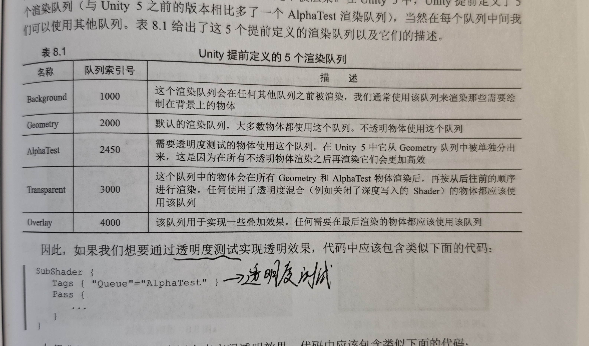

在工业软件和游戏开发中，透明效果是一种被广泛应用的视觉技术，常用于表示玻璃、水面、半透明塑料等材质。实现这一效果的核心在于对材质的透明通道（Alpha Channel）进行控制，即通过设置像素的透明度（Alpha值）来决定其在最终图像中的可见程度。

然而，在实时渲染中，仅仅设置 Alpha 值是不够的。为了正确显示透明对象，还需要处理好一个至关重要的问题：**渲染顺序的管理**。

在实时渲染中，通常使用**深度缓冲（depth buffer, z-buffer）**用于解决模型可见性问题。其**基本思想**：根据深度缓冲值来判断片元距离相机的距离，系统会将其深度值与深度缓冲中的已有值进行比较（**需开启深度测试**）。

* 如果当前片元比已有片元更远（即z值更大），说明它被其他物体遮挡，不应该被渲染，因此不会写入颜色缓冲
* 如果当前片元更近（即z值更小），则说明它在视野前方，应该覆盖已有颜色值，并更新其深度值到深度缓冲中（**需开启深度写入，Z-Write**）

---

## Unity中实现透明效果的方法

在Unity中，实现透明效果的方法有很多种，当前介绍两种基础的通用方法：

* **透明度测试（Alpha Test）**
  * 无法得到真正的半透明效果
  * **不需要关闭**深度写入
* **透明度混合（Alpha Blending）**
  * 可以得到真正的半透明效果
  * **需要关闭**深度写入
  * 在透明度混合中，深度缓冲是**只读**的

---

## 渲染顺序

假设场景中有两个物体A和B，A为半透明物体，B为不透明物体，且A到相机的距离比B要近。

* **Case 1：先渲染B，再渲染A**
  物体B由于不透明，会开启深度测试和深度写入，而此时深度缓冲区中没有任何有效数据，因此对物体B渲染时首先会写入颜色缓冲和深度缓冲。然后对于物体A进行渲染，透明物体仍然会进行深度测试，由于A到相机的距离比B要近，因此会使用物体A的透明度和颜色缓冲中的B的颜色进行混合，得到正确的半透明效果，即**A在B的前面**。
* **Case 2：先渲染A，再渲染B**
  渲染物体A时，深度缓冲区中没有任何有效数据，因此A直接写入颜色缓冲，且由于A是半透明物体，**深度写入被关闭了**，因此A不会修改深度缓冲。然后渲染物体B，B会进行深度检测，由于A没有写入深度缓冲数据，导致B写入深度数据会直接覆盖掉A的颜色。最终从视觉上看，会**出现B在A的前面**。

### 渲染顺序排序方法

渲染引擎一般都会对模型进行排序，再渲染。其常用方法有：

1. 先渲染所有不透明物体，并**开启他们的深度检测和深度写入**
2. 将半透明物体**按距离相机的远近**进行排序，然后按照**从后往前**的顺序渲染，并**开启深度检测，关闭深度写入**

### Unity渲染队列

在UnityShader中，可以使用SubShader的Queue标签来决定模型归于哪个渲染队列。Unity内部定义了5个渲染队列，**索引号越小则越早被渲染**。

---

## Reference

* 《UnityShader入门精要》
* 《Fundamentals of Computer Graphics》
* [Real-Time Rendering 4th](https://www.wolai.com/fkGSwxLu2pjWD7kiBY1V7W)
