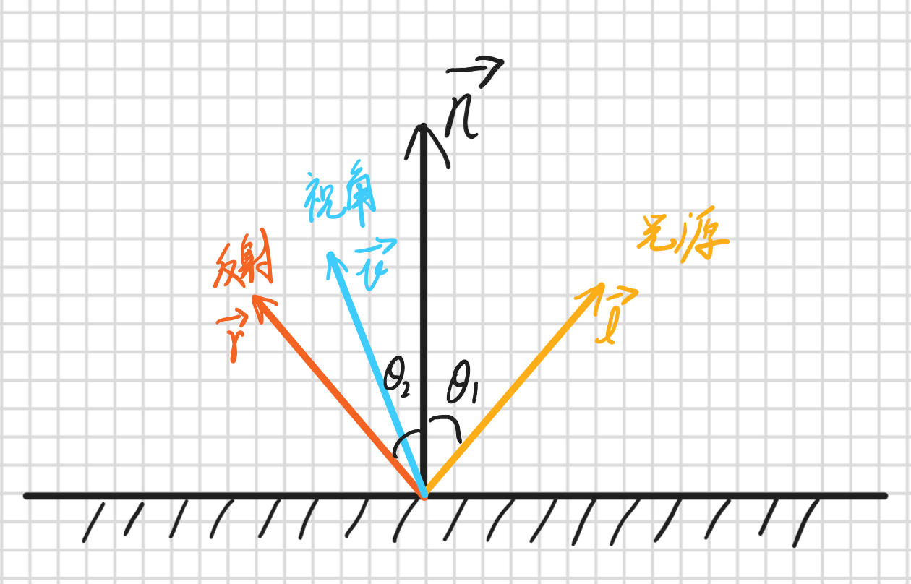
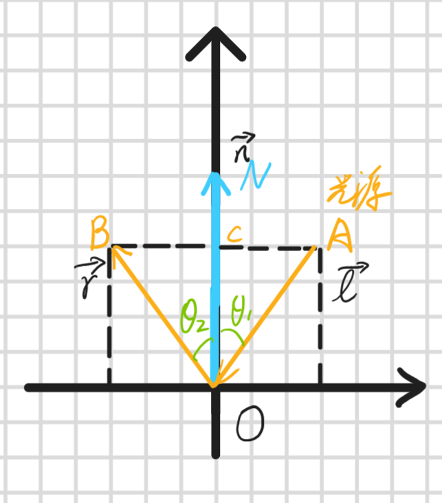
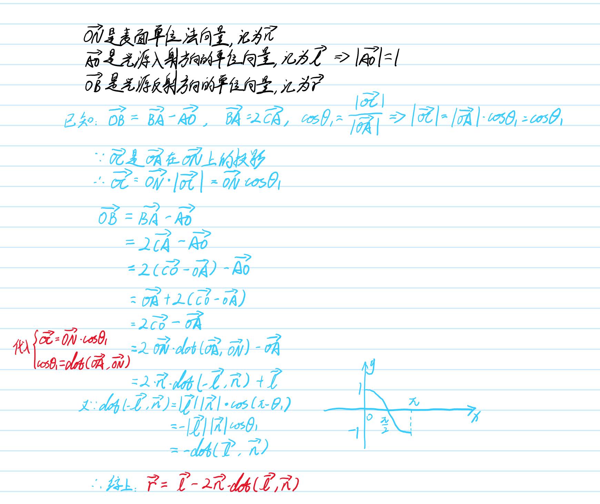
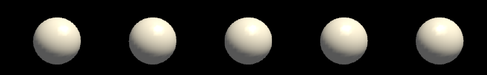
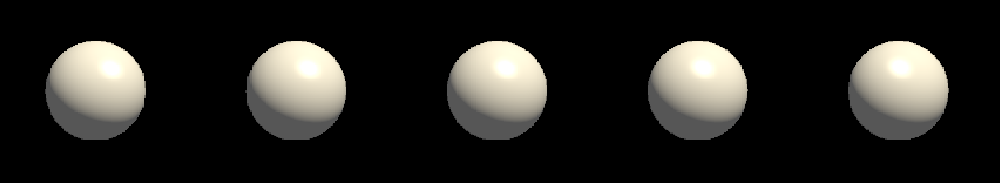

## 高光反射

### 定义

* 高光反射（镜面反射）是指物体表面上沿特定方向镜面反射光线而形成的、随观察角度变化的高亮区域，**用于在渲染过程中光滑表面对光线的精面反射现象**
* 高光反射是实时光照模型中的重要组成，主要用于表现物体表面的“光滑程度”和“材质质感”



### 反射公式

根据高光反射示意图，将示意图中的表面法向量、光源方向向量、反射方向向量进行归一化处理，并在二维坐标系中进行计算，如下图所示：



根据图中向量关系，可以推导出反射公式，推导过程如下图所示：

$$
reflect = lightDir - 2 * normal * (dot(lightDir, normal))
$$



---

## 高光反射基础光照模型

### 着色器基础结构

根据高光反射计算公式：

$$
c_{reflect} = (c_{light}\cdot{m_{specular}})max(0, \vec{v}\cdot{\vec{r}})^{m_{gloss}}
$$

从公式中可以看出需要五个参数：

* 入射光线颜色和强度：$c_{light}$
* 高光反射系数：$m_{specular}$
* 视角向量：$\vec{v}$
* 反射向量：$\vec{r}$，可通过 `reflect(I, N)`函数计算获得
* 光泽度：$m_{gloss}$，用于控制高光反射区域的大小

基于上述参数，我们可以在着色器中设置相关可调属性：

```hlsl
Properties
{
    _Diffuse ("漫反射颜色", Color) = (1, 1, 1, 1)
    _Specular ("高光反射颜色", Color) = (1, 1, 1, 1)
    _Gloss ("光泽度", Range(8.0, 256)) = 20
}
```

### 逐顶点光照

**原理**：和漫反射光照一样，在**顶点着色器**中计算光照（漫反射+高光反射），并将结果通过插值传递给**片段着色器**。

```hlsl
Shader "Custom/SpecularVertexLevel"
{
    Properties
    {
        _Diffuse ("漫反射颜色", Color) = (1, 1, 1, 1)
        _Specular ("高光反射颜色", Color) = (1, 1, 1, 1)
        _Gloss ("光泽度", Range(8.0, 256)) = 20
    }

    SubShader
    {
        Pass
        {
            Tags {"LightMode" = "ForwardBase"}

            CGPROGRAM

            #pragma vertex vert
            #pragma fragment frag

            #include "Lighting.cginc"

            fixed4 _Diffuse;
            fixed4 _Specular;
            float _Gloss;

            struct a2v
            {
                float4 vertex : POSITION;
                float3 normal : NORMAL;
            };

            struct v2f
            {
                float4 pos : SV_POSITION; 
                fixed3 color : COLOR;
            };

            v2f vert(a2v v)
            {
                //获取环境光的颜色和强度
                fixed3 ambient = UNITY_LIGHTMODEL_AMBIENT.xyz;
                //将法向量从模型空间坐标转成投影空间坐标
                fixed3 worldNormal = normalize(mul(v.normal, (float3x3)unity_WorldToObject));
                //获取光源方向
                fixed3 worldLightDir = normalize(_WorldSpaceLightPos0.xyz);
                //计算漫反射强度
                fixed3 diffuse = _LightColor0.rgb * _Diffuse.rgb * saturate(dot(worldNormal, worldLightDir));
                //获取反射方向
                fixed3 reflectDir = normalize(reflect(-worldLightDir, worldNormal));
                //获取视角方向
                fixed3 viewDir = normalize(_WorldSpaceCameraPos.xyz - mul(unity_ObjectToWorld, v.vertex).xyz);
                //计算高光反射
                fixed3 specular = _LightColor0.rgb * _Specular.rgb * pow(saturate(dot(reflectDir, viewDir)), _Gloss);
            
                v2f o;
                //将顶点从模型空间坐标转成投影空间坐标
                o.pos = UnityObjectToClipPos(v.vertex);
                //颜色 = 环境光 + 漫反射 + 高光反射
                o.color = ambient + diffuse + specular;
            
                return o;
            }

            fixed4 frag(v2f i) : SV_Target
            {
                return fixed4(i.color, 1.0);
            }

            ENDCG
        }
    }
    FallBack "Specular"
}
```



从图上可以看出，高光反射在逐顶点光照中表现的明显不够平滑，主要原因是高光反射的计算是**非线性**的，而在**顶点着色器**中的插值都是**线性**的，导致非线性计算关系被破坏了。

### 逐像素光照

* **原理**：在顶点着色器中计算每个顶点在裁剪空间中的顶点坐标、计算在世界空间中的法向量和顶点坐标，然后传递给**片元着色器**，在**片元着色器**中计算光照（漫反射+高光反射），并返回颜色。

```hlsl
// Upgrade NOTE: replaced '_Object2World' with 'unity_ObjectToWorld'

Shader "Custom/SpecularPixelLevel"
{
    Properties
    {
        _Diffuse ("漫反射颜色", Color) = (1, 1, 1, 1)
        _Specular ("高光反射颜色", Color) = (1, 1, 1, 1)
        _Gloss ("光泽度", Range(8.0, 256)) = 20
    }

    SubShader
    {
        Pass
        {
            Tags {"LightMode" = "ForwardBase"}

            CGPROGRAM

            #pragma vertex vert
            #pragma fragment frag

            #include "Lighting.cginc"

            fixed4 _Diffuse;
            fixed4 _Specular;
            float _Gloss;

            struct a2v
            {
                float4 vertex : POSITION;
                float3 normal : NORMAL;
            };

            struct v2f
            {
                float4 pos : SV_POSITION; 
                float3 worldNormal : TEXCOORD0;
                fixed3 worldPos : TEXCOORD1;
            };

            v2f vert(a2v v)
            {
                v2f o;
                //将顶点从模型空间坐标转成投影空间坐标
                o.pos = UnityObjectToClipPos(v.vertex);
                o.worldNormal = mul(v.normal, (float3x3)unity_WorldToObject);
                o.worldPos = mul(unity_ObjectToWorld, v.vertex).xyz;
            
                return o;
            }

            fixed4 frag(v2f i) : SV_Target
            {
                //获取环境光的颜色和强度
                fixed3 ambient = UNITY_LIGHTMODEL_AMBIENT.xyz;

                //获取世界坐标系下的法向量
                fixed3 worldNormal = normalize(i.worldNormal);
                //获取光源方向
                fixed3 worldLightDir = normalize(_WorldSpaceLightPos0.xyz);
                //计算漫反射强度
                fixed3 diffuse = _LightColor0.rgb * _Diffuse.rgb * saturate(dot(worldNormal, worldLightDir));

                //获取反射方向
                fixed3 reflectDir = normalize(reflect(-worldLightDir, worldNormal));
                //获取视角方向
                fixed3 viewDir = normalize(_WorldSpaceCameraPos.xyz - i.worldPos.xyz);
                //计算高光反射
                fixed3 specular = _LightColor0.rgb * _Specular.rgb * pow(saturate(dot(reflectDir, viewDir)), _Gloss);

                fixed3 color = ambient + diffuse + specular;
                return fixed4(color, 1.0);
            }

            ENDCG
        }
    }
    FallBack "Specular"
}

```



从图上可以看出，使用逐像素光照方式，高光反射效果能够得到更加平滑的效果，比逐顶点光照效果更好。

---

## Reference

* 《UnityShader入门精要》
* [Shader实验室：reflect函数 - Shader实验室的文章 - 知乎](https://zhuanlan.zhihu.com/p/152561125)
* [Unity Shader - 基础光照之高光反射（Specular） - 长生但酒狂的文章 - 知乎](https://zhuanlan.zhihu.com/p/138558598)
