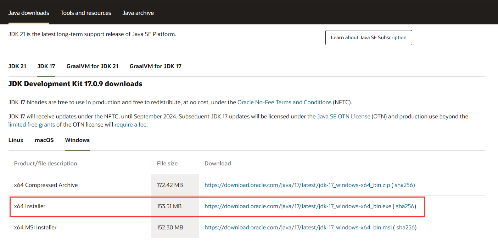
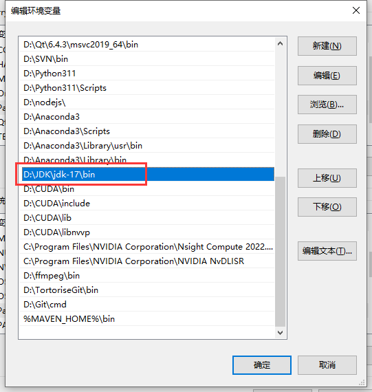
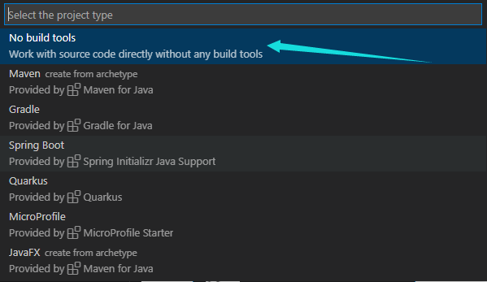
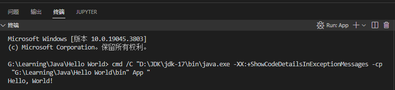

本项目是一个基于Java Swing开发的网络聊天/即时通讯程序，整个项目会参考Cherno大佬的[Network Chat Programming](https:/www.youtube.com/playlist?list=PLlrATfBNZ98cCvNtS7x4u1bZOS5FBwOSb)的系列视频进行开发。
**本项目的目标**：熟悉Java语言、学会Java相关的GUI开发

## 项目环境配置

在本项目中，我使用vscode作为编辑器，因此需要在vscode上配置对应的Java开发环境来支持项目开发。

### JDK

- **下载JDK**
  **链接**：[JDK下载](https:/www.oracle.com/java/technologies/downloads/)
  基于我个人习惯，我习惯选择LTS版本的软件和SDK，因此我选择了17.0.9版本的JDK，并且开发的系统平台为Windows。
  
- **添加JDK**
  因为我使用的是Windows平台，因此在安装JDK时选择将java环境添加到系统环境变量中即可。
  

### 在vscode中配置Java环境

在vscode中下载以下插件：

- Language Support for Java™ by Red Hat
- Debugger for Java
- Java Test Runner
- Maven for Java
- Project Manager for Java
  

## 创建项目

- 使用 `CTRL+SHIFT+P`输入 `Java: create Project`。
  
- 选择 `No build tools`，然后选择对应的项目存储路径，并输入项目名称 `network-chat-Swing`。
  
- 创建成功的项目对应的项目目录结构如图所示
  
- Hello World 程序

```java
public class App {
    public static void main(String[] args) throws Exception {
        System.out.println("Hello, World!");
    }
}
```

按 `F5`运行，其运行结果如下：


- Swing测试程序
  由于本项目使用Swing作为GUI，并且在JDK17中已经内置了Swing对应的库，所以，我编写了下面一段程序测试当前环境是否可以正确运行Swing程序。

  ```java
  import javax.swing.*;
  import java.awt.*;

  public class Application extends JFrame {
  private static JLabel Label = new JLabel("Hello World!");/ 创建一个Label控件

  public static void main(String[] args) throws Exception {
      Application window = new Application();
      window.setSize(600, 400);
      window.setVisible(true);
      window.setTitle("network-chat-Swing");

      window.setLayout(new FlowLayout());/ 设置窗口布局为流式布局
      window.getContentPane().add(Label);/ 向对话框的内容面板中添加label
      }
  }
  ```

按 `F5`运行，其运行结果如下：

对话框成功显示，说明配置的环境正确，后续就可以开始项目的相关开发了。

---

## 参考

[1] [VScode 配置 Java 开发环境 (VSCode 天下第一!!!!!)](https:/blog.csdn.net/weixin_40448140/article/details/105904836)
[2] [JFrame app create a Swing JFrame using Visual Studio Code part 0/3](https:/youtu.be/WOooJ_165xY?si=MIxqleJA5D8bCJgq)
