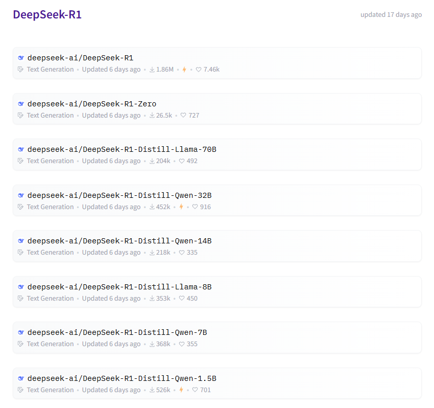
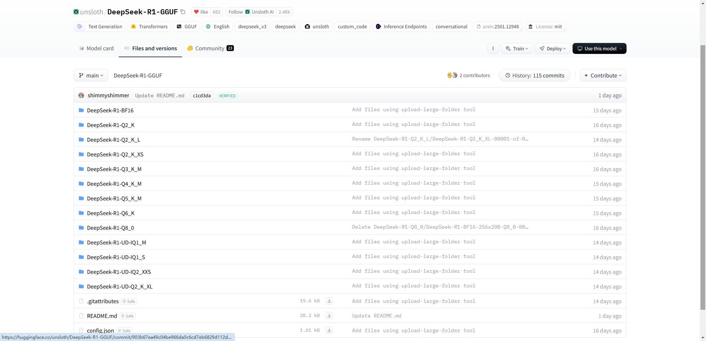
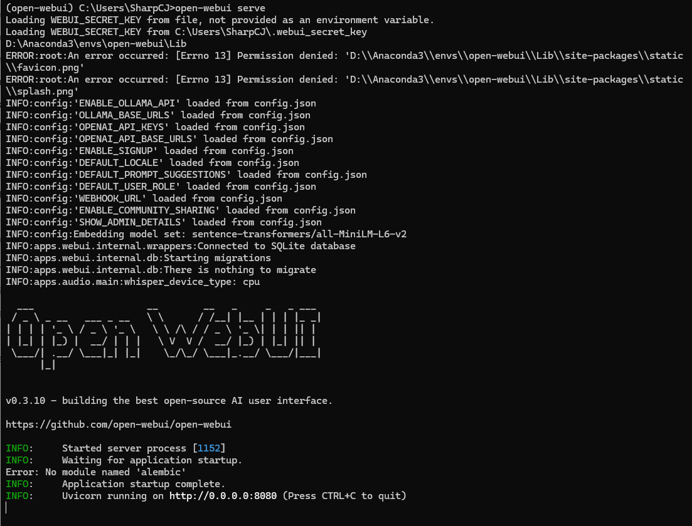
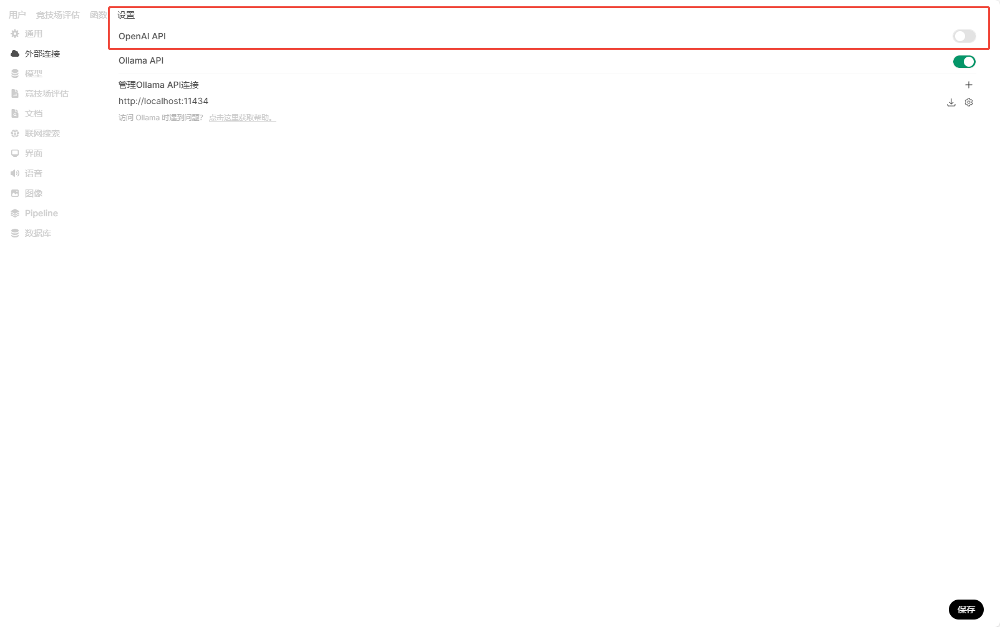

## 部署环境

* CPU：i9-13900K, 32内核
* GPU：NVIDIA RTX 4090 24GB
* 运行内存：32GB*4
* 硬盘：SSD 1TB*2
* 操作系统：Ubuntu 20.04 LTS

---

## Ollama

Ollama是一个开源工具，专门用于在本地运行、管理和部署大型语言模型（LLMs，Large Language Models）。它简化了LLMs的安装、配置和运行流程，支持多种流行的开源模型（如 LLaMA、Mistral、DeepSeek等），适合开发者和研究人员在本地环境中快速实验和开发。

### 安装Ollama

* Ollama的官网地址：[Ollama](https://ollama.com)，可以先尝试一下直接从官网下载适合自己本地环境的版本，Linux、Windows和MacOS都有相应的支持。
* 若网络环境不佳，可考虑直接在[GitHub仓库](https://github.com/ollama/ollama/releases)中下载对应环境的安装包，然后进行安装。
* 安装完成后，启动Ollama：`ollama serve`
* 启动一个新的终端，确认 Ollama 正在运行：`ollama -v`
* Ollama相关技术文档：[Ollama Docs](https://github.com/ollama/ollama/tree/main/docs)

### 设置Ollama远程访问

* 暂停ollama服务：`sudo systemctl stop ollama`
* 修改配置文件：`sudo nano /etc/systemd/system/ollama.service`，在配置文件的[Service]下如下语句：

    ```bash
    Environment="OLLAMA_HOST=0.0.0.0"
    Environment="OLLAMA_ORIGINS=*"
    ```

* 修改同步：`sudo systemctl daemon-reload`
* 重启Ollama：`sudo systemctl restart ollama`，然后在本地配置一个远程的ip地址和相应端口就可以进行访问了

---

## 下载和运行DeepSeek R1模型

* DeepSeek R1模型分为两种：
  * 完整模型
  
  * 蒸馏模型
  

### 下载DeepSeek R1模型

下载DeepSeek R1模型有两种方法：一种是使用Ollama拉取的操作直接下载模型，另一种是从HuggingFace、modelscope等模型网站上下载GGUF格式模型，然后使用ollama进行模型构建。

:::important
经过测试发现，gguf模型运行时回答存在问题，但直接通过ollama下载官方模型运行则无问题。**因此建议使用Ollama拉取的操作进行下载**。
:::

#### 方式一：使用Ollama拉取的操作进行模型下载(⭐推荐)

* 访问Ollama官方的模型库中的[DeepSeek-R1](https://ollama.com/library/deepseek-r1)，根据本地硬件条件选择合适的版本(**Note: 下方表格内容源于网络**)。

| 标准参考规格 | 典型应用场景 | CPU 推荐 | GPU 推荐 | 内存 (RAM) 推荐 | 适用场景 |
| ------------ | ------------ | -------- | -------- | --------------- | -------- |
| 1.5b (15 亿) | 小型进阶理、教育训练 | 4核以上 (Intel i5 / AMD Ryzen 5) | 可选、入门级 GPU（如NVIDIA GTX 1650，4GB显存） | 8GB | 小型 NLP、文本分类、文本分析 |
| 7b (70亿) | 中型模型、推理任务 | 6核以上 (Intel i7 / AMD Ryzen 7) | 中端 GPU（如NVIDIA RTX 3060，12GB显存） | 16GB | 中型 NLP、文本分类、文本分析 |
| 14b (140亿) | 中大型模型、复杂推理任务 | 8核以上 (Intel i9+ / AMD Ryzen 9) | 高端 GPU（如NVIDIA RTX 3090，24GB显存） | 32GB | 高端 NLP、多语种训练、文献分析 |
| 32b (320亿) | 大型模型、高精度任务 | 12核以上 (Intel Xeon / AMD Ryzen 9 / Threadripper) | 高端 GPU（如NVIDIA A100，40GB显存） | 64GB | 大型模型、高精度 NLP、文本生成 |
| 70b (700亿) | 超大型模型、推理、研究 | 16核以上 (Intel Xeon / AMD EPYC) | 专业级 GPU（如NVIDIA A100，80GB显存） | 128GB | 超大规模 NLP、企业级应用 |
| 671b (6710亿) | 超大规模训练、企业级任务 | 20核以上 (Intel Xeon / AMD EPYC / Intel Xeon) | 服务器级 GPU（如NVIDIA A100，100GB显存） | 256GB 或更高 | 超大规模 NLP、企业级平台 |

* 使用如下指令进行拉取：`ollama pull deepseek-r1:14b`
* 若拉取成功，结果如下所示：

    ```bash
    ollama pull deepseek-r1:14b
    pulling manifest
    pulling 6e9f90f02bb3... 100% ▕██████████████████████████▏ 9.0 GB
    pulling 369ca498f347... 100% ▕██████████████████████████▏  387 B
    pulling 6e4c38e1172f... 100% ▕██████████████████████████▏ 1.1 KB
    pulling f4d24e9138dd... 100% ▕██████████████████████████▏  148 B
    pulling 3c24b0c80794... 100% ▕██████████████████████████▏  488 B
    verifying sha256 digest
    writing manifest
    success
    ```

* 启动模型：`ollama run deepseek-r1:14b`

#### 方式二：在HuggingFace上下载GGUF格式的模型

* DeepSeek-R1官方模型地址：[DeepSeek-R1](https://huggingface.co/deepseek-ai/DeepSeek-R1)

* DeepSeek-R1 GGUF格式模型：[DeepSeek-R1-GGUF](https://huggingface.co/unsloth/DeepSeek-R1-GGUF)

* 编写`Modelfile`文件(模型配置文件)，下方为文件模板：

    ``` bash
    # gguf模型文件路径  
    FROM .\DeepSeek-R1-Distill-Qwen-32B-Q4_K_M.gguf

    # 设定模型参数（可选）
    PARAMETER temperature 0.6

    # 模型模板配置  
    TEMPLATE """{{- if .System }}{{ .System }}{{ end }}  
    {{- range $i, $_ := .Messages }}  
    {{- $last := eq (len (slice $.Messages $i)) 1}}  
    {{- if eq .Role "user" }}  
    user: {{ .Content }}  
    {{- else if eq .Role "assistant" }}  
    assistant: {{ .Content }}{{- if not $last }}  
        {{- end }}  
    {{- end }}  
    {{- if and $last (ne .Role "assistant") }}  
    {{- end }}  
    {{- end }}"""  

    PARAMETER stop "<｜begin▁of▁sentence｜>"
    PARAMETER stop "<｜end▁of▁sentence｜>"
    PARAMETER stop "<｜User｜>"
    PARAMETER stop "<｜Assistant｜>"
    ```

* 使用ollama构建模型
  * 在命令行中切换到gguf模型所在目录
  * 输入命令`ollama create deepseek-r1-32B -f .\Modelfile`
  * 构建完成后，使用`ollama list`命令查看模型列表，若出现`deepseek-r1-32B`字样，则表示构建成功。
* 启动模型：`ollama run deepseek-r1-32B`

---

## 部署open-webui

* 使用conda安装Python3.11

```bash
# 创建虚拟环境
conda create -n deepseek_webui python=3.11
# 激活虚拟环境
conda activate deepseek_webui
# 查看Python版本
python --version
```

* 更换pip源：`pip config set global.index-url https://mirrors.aliyun.com/pypi/simple/`
* 安装open-webui：`pip install open-webui`
* 启动open-webui：`open-webui serve`，当看到如下界面，说明启动成功了

* 访问open-webui：`http://localhost:8080/`，会看到如下界面，接下来注册账号，登录即可


:::note
⭐第一次启动 Open-WebUI 可能会比较慢，原因是它默认会连接OpenAI的API。为了提高后续使用的响应速度，建议在首次登录后进入设置界面，关闭与OpenAI API连接的功能。

:::

---

## References

* [DeepSeek-R1](https://huggingface.co/deepseek-ai/DeepSeek-R1)
* [Ubuntu Linux部署DeepSeek](https://www.cnblogs.com/dechinphy/p/18699554/deepseek)
* [Windows11本地部署DeepSeek加速](https://www.cnblogs.com/dechinphy/p/18702523/deepseek2)
