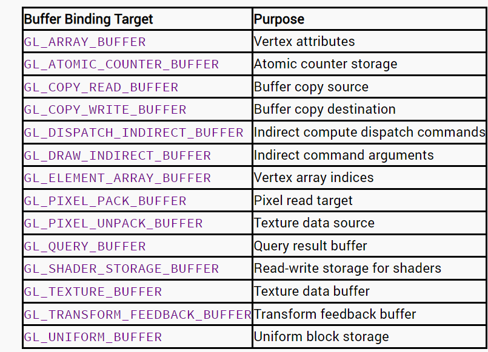

## OpenGL上下文

OpenGL自身是一个巨大的状态机(State Machine)：一系列的变量描述OpenGL此刻应当如何运行。OpenGL的状态通常被称为OpenGL上下文(Context)。我们通常使用如下途径去更改OpenGL状态：设置选项，操作缓冲。最后，我们使用当前OpenGL上下文来渲染。
当使用OpenGL的时候，我们会遇到一些状态设置函数(State-changing Function)，这类函数将会改变上下文。以及状态使用函数(State-using Function)，这类函数会根据当前OpenGL的状态执行一些操作。

---

## 基元、管线和像素

---

## 着色器

* 着色器阶段：编写代码时着色器创建顺序
  * 顶点着色器 -> 细分曲面控制和评价着色器 -> 几何着色器 -> 片段着色器 -> 计算着色器

---

## 数据

### 缓冲(Buffer)

* **定义**
  * 在OpenGL中，缓冲指的是内存的**线性分配**
  * 缓冲通过名称（name）进行表示，其本质是OpenGL用来识别缓冲的**不透明句柄**
  * 分配给缓冲对象的内存称之为数据库
* **创建缓冲和分配内存**
  * 缓存对象一般以`GLuint`变量表示
  * 创建缓存对象：`glCreateBuffers`

    |          | 定义                                             |
    | -------- | ------------------------------------------------ |
    | 函数原型 | `void glCreateBuffers(GLsizei n, GLuint*buffers);` |
    | 参数定义 | n: 定义要创建缓冲区对象的个数                    |
    | 参数定义 | buffers: 定义用于存储缓冲区对象名称的数组        |

  * 绑定缓冲对象：glBindBuffer

    |                    | 定义                                                       |
    | ------------------ | ---------------------------------------------------------- |
    | 函数原型           | `void glBindBuffer(GLenum target, GLuint buffer);`           |
    | 参数定义           | target: 定义缓冲区对象绑定的目标类型                       |
    | 参数定义           | buffer: 定义缓冲区对象名称                                 |

    :::note
    **缓冲区对象目标类型**
    
    :::

---

## Reference

* [LearnOpenGL](https://learnopengl-cn.github.io/)
* 《OpenGL 超级宝典（第七版）》
