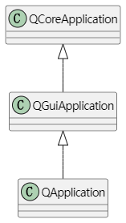
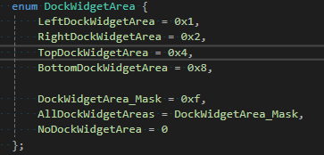
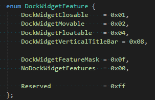

## QCoreApplication、QGuiApplication和QApplication

* 类关系图



* 区别
  :::note
  * QCoreApplication定义在**core模块**中，为应用程序提供了一个非gui的事件循环
  * QGuiApplication定义在**gui模块**中，提供了额外的gui相关的设置，比如桌面设置，风格，字体，调色板，剪切板，光标；
  * QApplication定义在**widgets模块**中，是QWidget相关的，能设置双击间隔，按键间隔，拖拽距离和时间，滚轮滚动行数等，能获取桌面，激活的窗口，模式控件，弹跳控件等。
    :::

---

## QMainWindow

* 设置窗口大小

  ```c++
  void resize(int w, int h);
  void resize(const QSize &);
  ```

* 设置窗口标题

  ```c++
  void setWindowTitle(const QString &);
  ```

* 添加QDockWidget

  ```c++
  void addDockWidget(Qt::DockWidgetArea area, QDockWidget *dockwidget);
  void addDockWidget(Qt::DockWidgetArea area, QDockWidget *dockwidget, Qt::Orientation orientation);
  ```

---

## QDockWidget

* Qt::DockWidgetArea：表示QDockWidget可以放置的位置（上下左右），为**枚举类型**



* QDockWidget::DockWidgetFeature：设置QDockWidget相关属性
  * 可关闭
  * dock部件可以由用户在dock之间移动
  * 可以将dock部件与主窗口分离，并作为独立窗口浮动
  * dock部件在左侧显示一个垂直的标题栏
  * 无法关闭、移动或浮动dock部件


