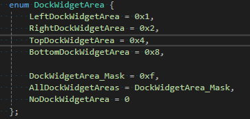
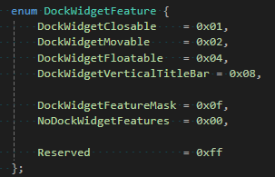

## QCoreApplication、QGuiApplication和QApplication

* 类关系图


* 区别
  :::note
  * QCoreApplication定义在**core模块**中，为应用程序提供了一个非gui的事件循环
  * QGuiApplication定义在**gui模块**中，提供了额外的gui相关的设置，比如桌面设置，风格，字体，调色板，剪切板，光标；
  * QApplication定义在**widgets模块**中，是QWidget相关的，能设置双击间隔，按键间隔，拖拽距离和时间，滚轮滚动行数等，能获取桌面，激活的窗口，模式控件，弹跳控件等。
    :::

---

## QMainWindow

* 设置窗口大小

  ```c++
  void resize(int w, int h);
  void resize(const QSize &);
  ```

* 设置窗口标题

  ```c++
  void setWindowTitle(const QString &);
  ```

* 添加QDockWidget

  ```c++
  void addDockWidget(Qt::DockWidgetArea area, QDockWidget *dockwidget);
  void addDockWidget(Qt::DockWidgetArea area, QDockWidget *dockwidget, Qt::Orientation orientation);
  ```

---

## QDockWidget

* Qt::DockWidgetArea：表示QDockWidget可以放置的位置（上下左右），为**枚举类型**



* QDockWidget::DockWidgetFeature：设置QDockWidget相关属性
  * 可关闭
  * dock部件可以由用户在dock之间移动
  * 可以将dock部件与主窗口分离，并作为独立窗口浮动
  * dock部件在左侧显示一个垂直的标题栏
  * 无法关闭、移动或浮动dock部件



---

## QOpenGLWidget

* QOpenGLWidget类是用于呈现OpenGL图形的小部件
* **核心函数**
  * `paintGL()`：渲染OpenGL场景。每当需要更新小部件时调用。
  * `resizeGL ()`：设置OpenGL视区、投影等。每当小部件调整了大小时都会调用该视区（并且当它第一次显示时也会调用，因为所有新创建的小部件都会自动获得一个调整大小的事件）。
  * `initializeGL()`：设置OpenGL呈现上下文，定义显示列表等。在第一次调用resizeGL ()或paintGL ()之前调用一次。
* **更新绘制**
  * 如果需要从paintGL()以外的地方触发重新绘制（典型的例子是使用计时器来动画场景），您应该调用小部件的update()函数来安排更新。
  * 当调用paintGL()、resizeGL()或initializeGL()时，小部件的OpenGL呈现上下文成为当前上下文。如果需要从其他地方调用标准的OpenGL API函数（例如，在小部件的构造函数或自己的paint函数中），则必须首先调用makeCurrent()。
  * 所有渲染都发生在OpenGL帧缓冲区对象中。makeCurrent()确保它在上下文中绑定。在paintGL()中的呈现代码中创建和绑定其他framebuffer对象时，请记住这一点。永远不要重新绑定ID为0的帧缓冲区。相反，调用defaultFrameBufferObject()获取应该绑定的ID。
  * 当平台支持时，QOpenGLWidget允许使用不同的OpenGL版本和配置文件。只需通过setFormat()设置请求的格式。但是请记住，在同一窗口中拥有多个QOpenGLWidget实例需要它们都使用相同的格式，或者至少使用不使上下文不可共享的格式。要解决此问题，最好使用QSurfaceFormat::setDefaultFormat()而不是setFormat()。
  
  :::warning
  注意：当请求OpenGL核心配置文件上下文时，在某些平台（例如MacOS）上，在构造QApplication实例之前调用QSurfaceFormat::setDefaultFormat()是必需的。这是为了确保上下文之间的资源共享保持功能性，因为所有内部上下文都是使用正确的版本和配置文件创建的。
  :::
